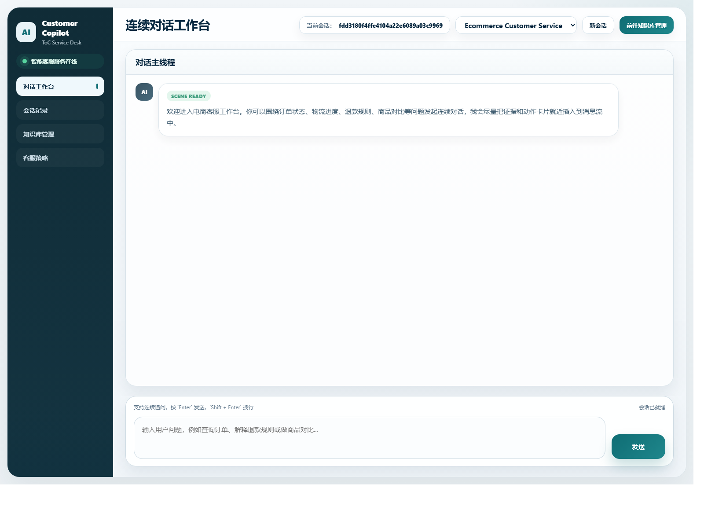
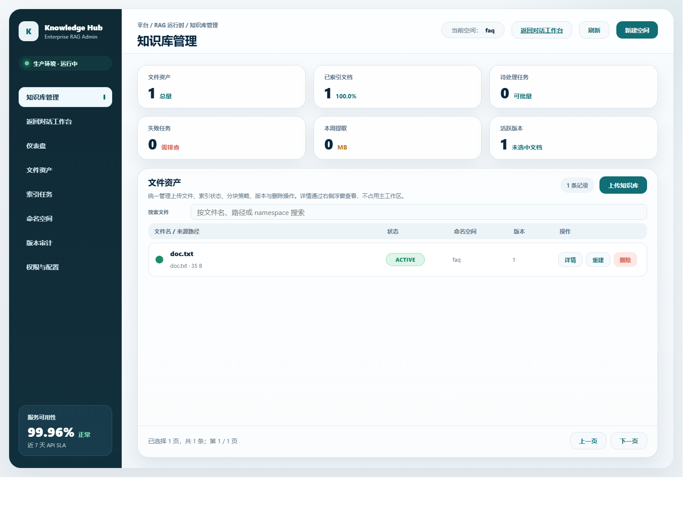

# AI RAG Project

一个面向多场景智能助手的 RAG 示例项目。仓库当前已经收敛为清晰的三层后端架构：

- `platform`：平台级通用能力
- `application`：运行时装配与 API 暴露
- `scenes`：具体业务场景实现

当前默认场景为 `generic_assistant`，同时保留 `ecommerce` 作为电商演示场景。项目适合作为以下工作的起点：

- 搭建一个可运行的 FastAPI + RAG 后端
- 扩展新的会话场景、检索策略和场景工具
- 接入本地知识文档并完成向量检索
- 演示多场景会话路由与会话级场景切换

## 项目概览

当前后端提供统一的聊天、会话、文件和知识文档接口，并支持基于场景的能力编排。

核心能力包括：

- 统一 `/chat` 入口，按会话绑定场景处理请求
- 会话创建、查询、删除与场景选择
- 本地知识文件上传、下载、删除、预处理预览与索引管理
- 文档清洗、规则化处理、版本化切块与向量检索
- `Chroma` 与 `Elasticsearch` 两种向量存储实现
- 基于 `SQLite` 的会话记忆

当前内置场景：

- `generic_assistant`：通用助手场景，依赖通用知识与会话记忆
- `ecommerce`：电商演示场景，包含商品、评价、订单、库存等检索与工具能力

## 按功能看当前状态

### 1. 架构与场景编排

已支持：

- 采用 `platform / application / scenes` 三层结构，平台能力、运行时装配和场景实现边界比较清晰。
- 已内置 `generic_assistant` 与 `ecommerce` 两个场景，具备“通用能力 + 场景扩展”的基本形态。
- 支持按会话绑定场景处理请求，能够作为多场景智能助手的运行时入口。

当前缺口：

- 还没有显式的工作流编排机制，当前更偏固定 RAG 流程而不是可配置流程。
- 还缺少多 Agent 分工协作、结果汇总和冲突处理机制。
- 还缺少插件协议、标准化扩展接口和 Agent 开发套件。

对外可讲：

- 三层架构适合强调“平台能力与业务场景解耦”。
- 会话级场景路由适合强调“不是单一 Prompt Demo，而是场景化容器”。

### 2. 对话与会话能力

已支持：

- 提供统一 `/chat` 入口，按会话上下文处理对话请求。
- 支持会话创建、查询、删除，以及会话级场景选择。
- 已基于 `SQLite` 提供基础会话记忆与聊天上下文持久化。

当前缺口：

- 还缺少显式的任务拆解、步骤规划和多步执行能力。
- 还缺少摘要记忆、长期记忆、上下文压缩等更完整的 Memory 体系。
- 还缺少 `SSE` / `WebSocket` 流式返回与长链路消息分发能力。

对外可讲：

- 当前实现已经足够支撑一个可运行的多轮对话后端。
- 会话记忆已落地，适合包装成 Memory 的基础版实现。

### 3. 知识库与 RAG 能力

已支持：

- 支持本地知识文件上传、下载、删除与索引管理。
- 支持上传后预处理预览、规则选择、正式入库、重处理和重切块。
- 支持文档切块、索引重建、向量检索和版本切换，RAG 主链路已经跑通。
- 向量存储已支持 `Chroma` 和 `Elasticsearch` 两种实现。
- 已补充 `agentic_rag.md`，说明多轮召回、工具切换、Query Rewrite 和证据聚合思路。

当前缺口：

- 还缺少 `Hybrid Search`、`ReRank`、缓存、增量更新等工程化 RAG 优化能力。
- 还缺少评测集、效果指标和可重复执行的 Evaluation Harness。
- 还缺少错误样本沉淀、版本对比和数据回放形成的数据闭环。

对外可讲：

- 文件上传、切块、索引、检索、回答生成已经形成完整闭环，适合讲“从 0 到可运行系统”。
- 向量存储可切换，适合讲存储层可插拔设计。

### 4. 工具与 Agent Runtime

已支持：

- 场景层已经有商品、评价、订单、库存等能力入口，具备继续演进为 Tool Use 的基础。
- 当前项目结构允许把工具、检索和场景逻辑继续向运行时统一收敛。

当前缺口：

- 还缺少统一 `Tool Registry`、函数调用协议和工具路由策略。
- 还缺少任务状态机、中间态存储、超时控制、失败恢复和断点续跑机制。
- 还缺少 Reflection、自我修正、重试决策和错误归因链路。
- 还缺少异步任务队列、调度执行和长期任务管理能力。

对外可讲：

- 电商场景中的能力入口说明项目已经具备 Tool Use 的扩展落点。
- 当前仓库更像 Agent Runtime 的起点，而不是一次性问答 Demo。

### 5. API、调试页面与测试

已支持：

- 后端已暴露聊天、会话、文件、知识文档、健康检查等统一接口。
- 提供 API 调试页和知识库管理页，便于本地联调和演示。
- 已有后端测试目录和 `pytest` 运行方式说明。

当前缺口：

- 目前前端仍以调试页为主，还不是完整产品化界面。
- 还缺少更系统的自动化评测与端到端验证能力。

对外可讲：

- 本地可运行、可调试、可演示，适合做面试或方案展示时的现场演示。

### 6. 工程化与生产能力

已支持：

- 已有基础运行说明、环境变量示例和向量存储切换方式。
- 已具备本地启动后端与切换 `Elasticsearch` 的基本操作路径。

当前缺口：

- 还缺少结构化日志、指标监控、Trace 链路和关键节点埋点。
- 还缺少限流、熔断、降级、幂等和智能重试等高可用机制。
- 还缺少账号体系、权限边界、操作审计和敏感工具隔离能力。
- 还缺少真实业务 API、数据库或第三方系统接入形成业务闭环。
- 还缺少 `Docker`、`CI/CD`、环境隔离和线上部署说明。
- 还缺少图片、语音、表格等多模态输入处理能力。

对外可讲：

- 这个仓库已经有清晰的工程骨架，适合作为继续补齐生产能力的底座。

## 优先演进方向

### P0：优先补齐 Agent 主链路

- [ ] 在对话层补充 Planning、多步执行和更完整的 Memory 体系。
- [ ] 在工具层补充统一 Tool Registry、函数调用协议和工具路由。
- [ ] 在运行时补充状态机、中间态管理、超时控制、失败恢复和断点续跑。
- [ ] 在 RAG 层补充 Query Rewrite、Hybrid Search、ReRank、引用溯源和效果评测。
- [ ] 在决策层补充 Reflection、错误归因和自我修正链路。

### P1：补强工程化与可上线能力

- [ ] 支持 SSE 或 WebSocket 流式输出与长链路消息分发。
- [ ] 补充结构化日志、核心指标监控和 Trace 链路追踪。
- [ ] 增加限流、熔断、降级、幂等和智能重试机制。
- [ ] 增加登录鉴权、角色权限、租户隔离和操作审计能力。
- [ ] 补充异步任务队列、调度执行和长期任务执行框架。
- [ ] 接入真实业务 API、数据库或第三方系统形成业务闭环。
- [ ] 补充 Docker、CI/CD、环境隔离和线上部署文档。

### P2：补齐高阶 Agent 与产品化能力

- [ ] 增加 Multi-Agent 分工协作、结果汇总和冲突处理机制。
- [ ] 支持可配置工作流编排，而不只依赖固定代码流程。
- [ ] 抽象插件协议与标准化工具接口，提升扩展性。
- [ ] 把调试页升级为可演示完整链路的正式产品界面。
- [ ] 支持图片、语音、表格等多模态输入与检索。
- [ ] 增加标签、版本、命中分析和分库权限等知识治理能力。
- [ ] 沉淀评测样本、错误案例和版本对比，形成持续优化闭环。

## 当前最适合对外讲的亮点

- [x] 三层架构已经清晰拆分，适合讲平台能力和业务场景解耦设计。
- [x] 已支持会话级场景切换，能够体现多场景智能助手的运行时路由能力。
- [x] 已跑通知识文件上传、切块、索引、检索和回答生成的基础 RAG 链路。
- [x] 已支持 `Chroma` 和 `Elasticsearch` 两种向量存储，具备一定的存储层可插拔能力。
- [x] 已有 `generic_assistant` 与 `ecommerce` 两个场景，具备继续扩展垂直业务场景的基础。
- [x] 已提供调试页、知识库管理页和设计文档，便于做本地演示与面试讲解。

## 设计文档

如果你希望先从设计层面理解这个项目，而不是直接读代码，可以先看下面的文档：

- [Agentic RAG 设计说明](./docs/agentic_rag.md)：解释本项目在多轮召回、工具切换、query 改写、证据聚合和最终回答生成上的完整链路

## 系统架构

后端采用三层结构，每层职责明确：

### 1. Platform

`backend/platform` 提供与具体场景无关的底层能力，包括：

- 配置加载与模型路由
- LLM 客户端封装
- 会话存储与聊天上下文
- 通用知识文档处理
- RAG 检索核心协议与实现

其中 `backend/platform/knowledge` 现在已经把原来的聚合式文档服务拆成更小的职责单元：

- `base/store.py`
  - 保留 `KnowledgeRetriever` 和 `KnowledgeDocumentRepository` 两套接口
  - provider 可以同时实现两套接口，但调用方按职责分别依赖
- `processing/`
  - 负责标准化、规则清洗、预处理预览、处理统计和 provenance 元数据生成
- `documents/application_service.py`
  - 负责预处理预览、注册文档、删除文档、重处理和重切块这些写流程
- `documents/query_service.py`
  - 负责文档列表、文档详情、文件索引状态聚合
- `documents/publisher.py`
  - 负责新版本发布、旧版本失活、失败恢复和清理新分块
- `documents/mappers.py`
  - 负责把仓储记录转换成摘要、详情和操作结果

`backend/application/runtime/api/knowledge/routes.py` 也已经直接依赖拆分后的 `application service` 和 `query service`，不再通过旧的聚合服务中转。

### 2. Application

`backend/application/runtime` 负责运行时装配，包括：

- 应用启动引导
- active scene 默认选择
- Chat service 组装
- FastAPI 应用与 API 路由注册

### 3. Scenes

`backend/scenes` 放置具体场景定义，包括：

- 场景提示词与定义
- 场景级检索工具
- 场景知识组织方式
- 场景特有的工具与服务

## 目录结构

```text
.
├─ backend/
│  ├─ application/
│  │  └─ runtime/                 # 运行时装配、服务编排、API 入口
│  ├─ platform/
│  │  ├─ config/                  # 配置与模型路由
│  │  ├─ knowledge/               # 通用知识文档处理与索引
│  │  ├─ memory/                  # 会话存储与聊天上下文
│  │  ├─ models/                  # 模型抽象与 LLM 客户端
│  │  ├─ rag/                     # RAG 核心协议与检索实现
│  │  └─ tools/                   # 通用工具协议
│  ├─ scenes/
│  │  ├─ generic_assistant/       # 通用助手场景
│  │  └─ ecommerce/               # 电商演示场景
│  ├─ tests/                      # 后端测试
│  ├─ data/                       # 本地数据与持久化目录
│  ├─ .env.example
│  ├─ requirements.txt
│  └─ run.py                      # 后端启动入口
├─ frontend/                      # 调试用静态页面
├─ docs/                          # 补充文档
├─ openspec/                      # 变更提案与规格文档
├─ AGENTS.md                      # 面向 AI Agent 的快速指引
└─ README.md
```

## 运行环境准备

以下命令默认在仓库根目录执行，示例使用 PowerShell。

### 1. 创建虚拟环境并安装依赖

```powershell
python -m venv backend\.venv
backend\.venv\Scripts\Activate.ps1
python -m pip install --upgrade pip
python -m pip install -r backend\requirements.txt
Copy-Item backend\.env.example backend\.env
```

### 2. 配置环境变量

至少需要在 `backend\.env` 中配置模型 API Key：

```env
AI_RAG_MODELS__SIMPLE__API_KEY=your-dashscope-api-key
AI_RAG_MODELS__MODERATE__API_KEY=your-dashscope-api-key
AI_RAG_MODELS__COMPLEX__API_KEY=your-dashscope-api-key
AI_RAG_APP__ACTIVE_SCENE=generic_assistant
AI_RAG_VECTOR_STORE__PROVIDER=chroma
```

说明：

- `AI_RAG_APP__ACTIVE_SCENE` 表示“新会话默认场景”
- 日常切换场景时，优先通过会话级 API 或前端选择，而不是频繁手工改环境变量

### 3. 启动后端

请直接使用虚拟环境中的解释器：

```powershell
backend\.venv\Scripts\python.exe backend\run.py
```

默认访问地址：

- API: `http://127.0.0.1:8000`
- Swagger: `http://127.0.0.1:8000/docs`
- API 调试页: `http://127.0.0.1:8000/frontend/api-tester.html`
- 知识库管理页: `http://127.0.0.1:8000/frontend/knowledge-manager.html`

## 界面预览

下面两张图展示了前端调试页和知识库管理页的默认界面，便于快速了解整体交互入口。

### 智能客服工作台



### 知识库管理页



## 接口与使用说明

当前主要接口分为四类：

- 聊天与会话：`/chat`、`/sessions`、`/scenes`
- 文件管理：`/files`
- 知识文档：`/knowledge/documents`
- 健康检查：`/health`

典型流程：

1. 启动服务
2. 通过 `POST /sessions` 创建会话并指定场景
3. 通过 `POST /chat` 发起对话
4. 如需知识增强，先通过 `POST /files/upload` 上传知识文件
5. 通过 `POST /knowledge/documents/preprocess-preview` 预览清洗规则、样本和统计
6. 通过 `POST /knowledge/documents` 确认入库；后续按需调用 `.../reprocess` 或 `.../rechunk`

知识库管理页当前交互：

- 上传 `json`、`csv`、`txt`、`md` 后会自动打开“数据预处理”弹窗
- 弹窗中可查看 `supported_rules`、切换 `processing_rules`、刷新预览并确认入库
- 未入库但可处理的文件状态为 `awaiting_processing`
- `pdf`、`docx`、`xlsx` 当前允许上传，但仅显示 `unsupported`，不会进入预处理与索引链路

## 向量存储

默认使用 `chroma`：

```env
AI_RAG_VECTOR_STORE__PROVIDER=chroma
AI_RAG_VECTOR_STORE__CHROMA__PERSIST_DIRECTORY=backend/data/.chroma
```

如需切换到 `Elasticsearch`：

```env
AI_RAG_VECTOR_STORE__PROVIDER=elasticsearch
AI_RAG_VECTOR_STORE__ELASTICSEARCH__URL=http://127.0.0.1:9200
```

本地启动 Elasticsearch：

```powershell
docker compose -f docs\elasticsearch\docker-compose.yml up -d
```

## 测试

全量后端测试：

```powershell
backend\.venv\Scripts\python.exe -m pytest backend\tests -q -c backend\tests\pytest.ini
```

单文件测试示例：

```powershell
backend\.venv\Scripts\python.exe -m pytest backend\tests\test_chat_api.py -q -c backend\tests\pytest.ini
```

## 开发说明

- 后端顶层代码以 `application / platform / scenes` 三层为核心组织方式
- 修改架构、启动方式、环境变量或测试命令时，应同步更新 `README.md`、`AGENTS.md` 和 `backend/.env.example`
- `__init__.py` 应保持轻量，避免在包初始化阶段引入运行时装配逻辑
- 知识文档写流程统一由 `KnowledgeDocumentApplicationService` 编排，并通过 `KnowledgeDocumentPublisher` 发布新版本；不要恢复聚合式文档服务
- 文档预处理能力位于 `backend/platform/knowledge/processing`，新增规则或统计逻辑优先落在该层

## 适用场景

如果你想基于这个仓库继续扩展，通常会从以下方向入手：

- 新增一个 `scene`，构建新的行业助手
- 扩展 `platform/knowledge`，增加新的文档处理能力
- 扩展 `platform/rag`，调整检索策略
- 增加前端页面或接入自己的业务 UI
