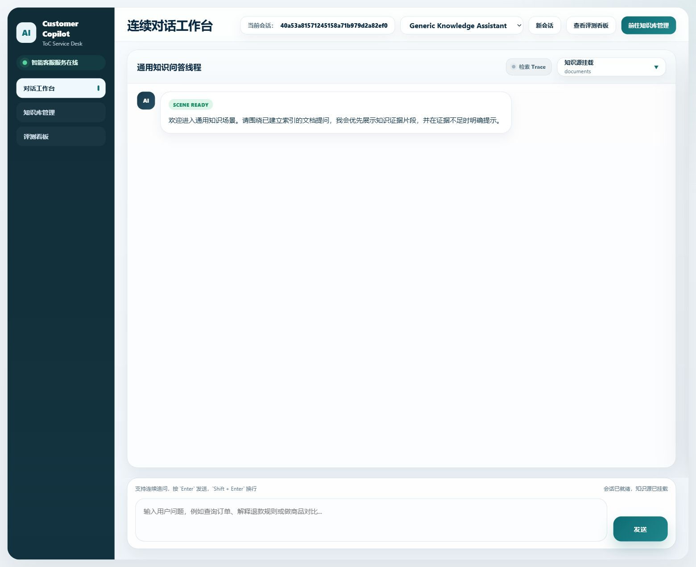
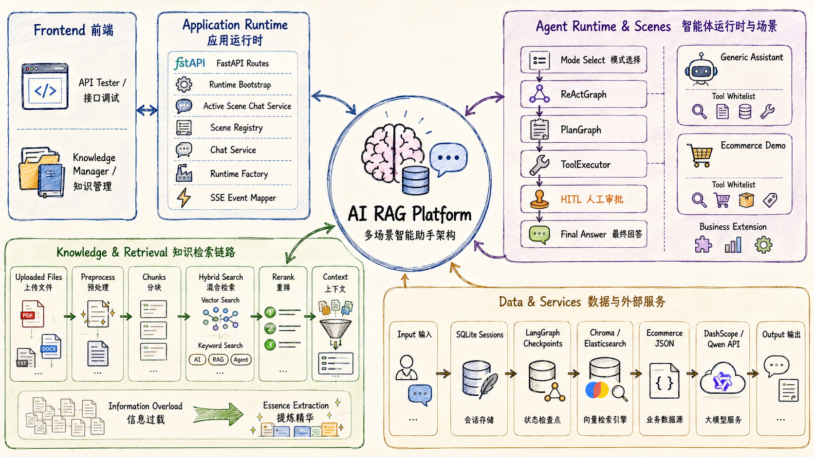
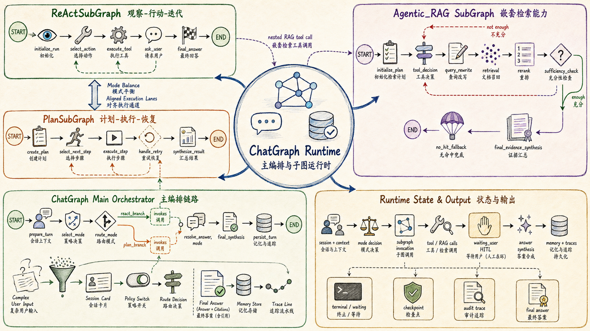

# AI RAG Project

面向企业知识问答与场景化智能助手的 **Agentic RAG / Agent Runtime** 示例项目。它不是单 Prompt Demo，而是一套可运行、可观测、可评测、可扩展的 RAG 应用底座。

项目已经打通知识文档入库、Hybrid Search、Agentic Retrieval、引用溯源、检索 Trace、SSE 流式输出、Human-in-the-Loop、Workflow State Machine、Evaluation Harness 和多场景扩展，适合用作 RAG 项目作品集、面试讲解样例或二次开发起点。

## 核心能力

- **统一对话入口**：`/chat` 由顶层 ChatGraph 编排模式选择、回答分支、HITL 和持久化；ReAct / Plan 子图负责执行工具调用，支持普通 JSON 和 SSE 流式输出。
- **Agentic RAG 工具链路**：先做 query rewrite 和工具决策，再多轮检索、判断证据是否足够，最后生成带引用的回答。它是顶层 Agent 可调用的工具能力，不是唯一入口。
- **Hybrid Search**：文档检索支持语义召回、BM25 关键词召回、融合排序、相关性过滤和 no-hit fallback。
- **引用与可观测性**：回答返回结构化 `citations`、正文引用编号、`retrieval_trace`、rerank trace；SSE 面向界面展示 `chunk / waiting_user / done`，审计细节保留在最终 payload 和 checkpoint。
- **Human-in-the-Loop**：支持澄清等待、工具审批、外部 API 审批，以及 `approve / reject / respond` 恢复。
- **Workflow State Machine**：运行时状态统一为 `created / planning / running / waiting_user / retrying / succeeded / failed / cancelled`，终态防重复恢复。
- **Knowledge Admin**：支持文件上传、预处理预览、正式入库、重处理、重切块、软删除和索引状态查看。
- **Evaluation Harness**：支持 minimal 与 retrieval benchmark 回放、baseline / candidate 对比和评测看板。
- **多场景扩展**：`generic_assistant` 是通用知识问答主线，`ecommerce` 是业务扩展示例，后端按 `platform / application / scenes` 分层。

## 项目截图

### 对话工作台



### 知识库管理


## 架构概览



```text
backend/
├─ application/        # FastAPI API、ChatService facade、运行时装配
│  └─ runtime/         # API 路由、ChatService facade、服务工厂和配置装配
├─ platform/           # RAG、知识处理、工具协议、Agent / Workflow Runtime
│  ├─ agent_runtime/   # ChatGraph runtime、ReAct / Plan 子图、工具执行
│  ├─ knowledge/       # 知识文档管理、处理、发布
│  ├─ rag/             # Agentic Retrieval、Hybrid Search、rerank
│  └─ workflow/        # LangGraph checkpoint、run lifecycle、状态机
├─ scenes/             # generic_assistant、ecommerce 等场景定义
│  ├─ generic_assistant/
│  └─ ecommerce/
├─ evals/              # HTTP / retrieval 评测脚本
└─ tests/              # 后端测试

frontend/              # 静态调试与管理页面
├─ api-tester.html
├─ knowledge-manager.html
└─ eval-dashboard.html
docs/                  # 架构、流程、API、计划与提示词文档
├─ documents/
├─ plan/
└─ prompts/
devops/                # 本地依赖与运维辅助配置
openspec/              # 变更提案、规格与归档记录
├─ changes/
└─ specs/
```

### ChatGraph 核心流程



对话运行时采用分层编排结构：顶层 **ChatGraph** 负责会话上下文准备、执行模式选择、分支路由、最终回答合成，以及记忆与 trace 持久化；**ReAct / Plan 子图** 分别承载即时工具调用与多步任务执行；**Agentic RAG Retrieval Graph** 作为嵌套检索能力，在执行过程中提供 query rewrite、文档召回、rerank、证据充分性判断和证据汇总。

该结构将主流程调度、任务执行和检索增强能力解耦，使系统能够同时支持普通问答、复杂任务规划、人工介入、运行状态恢复和可观测企业级助手场景。

核心链路：

```text
用户问题
  -> 会话与场景解析
  -> ChatService 准备 turn context
  -> ChatGraphRuntime / ChatGraph
  -> ReAct / Plan 子图
  -> RAG 工具或业务工具
  -> Hybrid Search / Agentic Retrieval / HITL
  -> 回答生成
  -> citations + retrieval_trace + workflow state
```

架构图和明细文档见：[文档索引](./docs/documents/README.md)。

## 文档入口

- [文档总索引](./docs/documents/README.md)
- [系统架构图](./docs/documents/architecture/system-overview.svg)
- [Main Chat Agent Runtime Flow](./docs/documents/runtime/main-chat-agent-runtime-flow.svg)
- [ReAct / Plan Agent Runtime](./docs/documents/runtime/react-plan-agent-runtime.md)
- [ChatGraph SubGraphs](./docs/documents/runtime/chatgraph-subgraphs.svg)
- [知识管理流程图](./docs/documents/knowledge/knowledge-document-flow.svg)
- [Agentic RAG 流程图](./docs/documents/rag/agentic-rag-retrieval-flow.svg)
- [Agentic RAG 设计说明](./docs/documents/rag/agentic-rag.md)
- [常见坑与排障](./docs/documents/operations/common-pitfalls.md)

## 当前进展与后续计划

### 已完成能力

- [x] **智能对话工作台**：提供统一 `/chat`、`/chat/resume` 和 `/sessions` 能力，支持普通 JSON 响应、SSE 流式输出、会话场景绑定和多知识源挂载。
- [x] **知识库管理**：支持文件上传、预处理预览、正式入库、重处理、重切块、软删除、索引状态查看和本地文档知识源检索。
- [x] **检索增强问答**：支持 query rewrite、Agentic Retrieval、Hybrid Search、相关性过滤、no-hit fallback、结构化引用、正文引用编号和检索 trace。
- [x] **多步 Agent 执行**：支持 ReAct / Plan 两类运行模式，顶层 ChatGraph 负责模式选择、分支路由、回答合成和会话持久化；ReAct / Plan 子图负责工具调用，RAG 只作为工具在子图内触发。
- [x] **人工介入流程**：支持澄清等待、工具审批、外部 API 审批，以及 `approve / reject / respond` 恢复；拒绝和取消会进入明确终态。
- [x] **运行状态与恢复**：基于 LangGraph checkpoint 和 Workflow State Machine 管理 `created / planning / running / waiting_user / retrying / succeeded / failed / cancelled` 状态，避免终态重复恢复。
- [x] **多场景扩展**：`generic_assistant` 作为通用知识助手主线，`ecommerce` 作为业务扩展示例；场景负责 prompt、工具范围和可用知识源。
- [x] **模型与工具接入**：统一 LLM、Embedding、ReRank 配置，提供工具注册、RAG tool adapter、业务工具调用和显式 scene-scoped tool policy。
- [x] **评测与诊断**：支持 HTTP replay、SSE replay、retrieval benchmark、baseline / candidate 对比、benchmark artifact 和评测看板。

### P0：增强 Agent 任务可靠性

- [x] **ChatGraph 子图迁移**：`/chat` 同步链路进入顶层 ChatGraph，`react_branch` / `plan_branch` 调用 ReAct / Plan 子图，不再在 application 层硬编码完整 Agent 执行循环。
- [x] **运行时重构审计**：已收敛 SSE 显示协议、ReAct / Plan 图内 HITL 恢复、runtime projection 和 scene-scoped tool policy，ChatService 保持 API facade 边界。
- [ ] **跨场景业务流转**：将 `generic_assistant` 到 `ecommerce` 的 handoff / follow-up 逻辑沉淀为可复用 router 或业务子图。
- [ ] **失败恢复**：为工具调用、模型调用和长链路任务补齐超时、重试、失败补偿、可恢复执行和幂等控制。
- [ ] **结果自检**：在多步任务中加入结果校验、失败原因归类和必要时的自我修正。

### P1：完善平台产品能力

- [ ] **工具中心**：统一工具注册、参数 schema、权限声明、Agent 白名单、MCP 暴露标记、调用结果协议和工具审计日志。
- [ ] **记忆能力**：从短窗口会话历史扩展到任务状态记忆、用户偏好、长期摘要和跨会话上下文。
- [ ] **流式体验**：统一 token、tool、interrupt、resume、done、error 等 SSE 事件，与 LangChain callback / LangGraph stream events 对齐。
- [ ] **评测体系**：在现有 RAG 指标外增加任务完成率、工具成功率、恢复成功率、LLM-as-a-judge 和多步任务质量评测。
- [ ] **成本与延迟指标**：沉淀 token、模型成本、P50/P95 延迟、检索耗时、rerank 耗时和端到端耗时。
- [ ] **场景扩展模板**：提供新增 scene、workflow、tool、eval sample 的标准目录、接口约束和测试样例。

### P1：强化知识库与检索体验

- [ ] **知识库运维**：支持批量重建索引、失败重试、索引状态诊断和上传文件清理。
- [ ] **增量与缓存**：支持文档增量索引、检索结果缓存、Embedding 缓存和缓存失效策略。
- [ ] **检索质量评估**：扩充 qrels 样本，稳定 Precision / Recall / MRR / NDCG / no-hit false positive 指标。
- [ ] **关键词召回增强**：为当前小规模 BM25 实现预留持久化倒排索引或外部搜索引擎边界。
- [ ] **检索诊断 UI**：展示 query rewrite、候选召回、过滤、rerank、citation 对齐和失败原因。

### P2：补齐生产化与开源闭环

- [ ] **权限与安全**：补齐用户、角色、知识库权限、工具调用权限、API Key、敏感信息过滤和审计日志。
- [ ] **可观测性**：接入结构化日志、OpenTelemetry Trace、模型调用 trace、工具调用 trace 和 eval run trace。
- [ ] **部署能力**：补齐 Docker Compose、生产配置样例、健康检查、备份恢复和日志采集。
- [ ] **模型治理**：支持模型路由策略、降级策略、超时重试、成本预算、调用审计和 provider fallback。
- [ ] **开源文档**：补齐架构决策记录、插件开发指南、Workflow DSL 示例、贡献指南和 Roadmap。
- [ ] **企业集成**：预留 SSO、对象存储、外部知识源、工单系统、CRM、内部搜索或支付/订单系统扩展点。

## Quick Start

示例使用 PowerShell，命令默认在仓库根目录执行。

```powershell
python -m venv backend\.venv
backend\.venv\Scripts\Activate.ps1
python -m pip install --upgrade pip
python -m pip install -r backend\requirements.txt
Copy-Item backend\.env.example backend\.env
```

在 `backend\.env` 中配置模型 Key：

```env
AI_RAG_MODELS__SIMPLE__API_KEY=your-dashscope-api-key
AI_RAG_MODELS__MODERATE__API_KEY=your-dashscope-api-key
AI_RAG_MODELS__COMPLEX__API_KEY=your-dashscope-api-key
AI_RAG_MODELS__EMBEDDING__API_KEY=your-dashscope-api-key
AI_RAG_MODELS__RERANK__API_KEY=your-dashscope-api-key
AI_RAG_APP__ACTIVE_SCENE=generic_assistant
AI_RAG_VECTOR_STORE__PROVIDER=chroma
```

启动后端：

```powershell
backend\.venv\Scripts\python.exe backend\run.py
```

访问入口：

- API: `http://127.0.0.1:8000`
- Swagger: `http://127.0.0.1:8000/docs`
- 对话工作台: `http://127.0.0.1:8000/frontend/api-tester.html`
- 知识库管理: `http://127.0.0.1:8000/frontend/knowledge-manager.html`
- 评测看板: `http://127.0.0.1:8000/frontend/eval-dashboard.html`

## 常用接口

- `POST /chat`：统一对话入口，支持 `stream=true` SSE。
- `POST /chat/resume`：恢复 HITL 等待点，支持 `approve / reject / respond`。
- `GET /sessions` / `POST /sessions`：会话创建、查询与场景绑定。
- `POST /files/upload`：上传知识文件。
- `POST /knowledge/documents/preprocess-preview`：知识文件预处理预览。
- `POST /knowledge/documents`：确认入库并发布索引。
- `GET /evals/latest` / `POST /evals/runs`：读取或触发评测回放。

接口和数据模型明细见：[API 文档](./docs/documents/reference/api-list.md)、[数据模型](./docs/documents/reference/data-model.md)。


