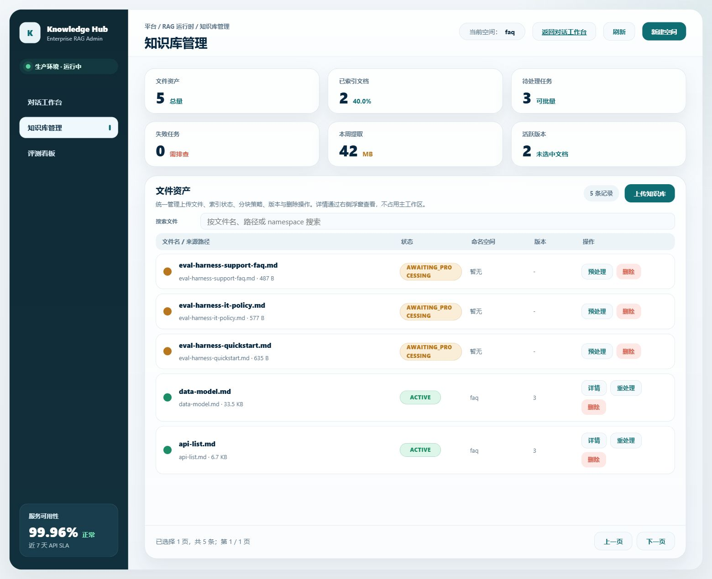

# AI RAG Project

面向企业知识问答与场景化智能助手的 **Agentic RAG Runtime**。它不是一个单 Prompt Demo，而是一套可运行、可观测、可评测、可扩展的 RAG 应用底座。

项目围绕真实工程链路设计：知识文档入库、Hybrid Search、Agentic Retrieval、引用溯源、检索 Trace、SSE 流式输出、Evaluation Harness 和多场景扩展都已经打通，适合用作 RAG 项目作品集、面试讲解样例或二次开发起点。

## Highlights

- **Agentic RAG 主链路**：统一 `/chat` 入口，按会话 scene 和 mounted knowledge sources 动态选择检索工具。
- **Hybrid Search**：文档检索支持语义召回、BM25 关键词召回与融合排序，可按 scene policy 控制 `top_k`、阈值和 no-hit fallback。
- **Retrieval Trace 可观测性**：单次请求可看到 query rewrite、tool decision、候选数量、过滤数量、top chunk score、citations 与 `knowledge_used`。
- **Knowledge Admin**：支持文件上传、预处理预览、正式入库、重处理、重切块、软删除和索引状态查看。
- **Evaluation Harness**：内置 minimal 与 retrieval benchmark 回放，支持 baseline / candidate 对比，便于量化调参效果。
- **多场景扩展**：`generic_assistant` 作为通用知识问答主线，`ecommerce` 作为业务扩展示例，架构按 `platform / application / scenes` 分层。
- **可运行前端**：提供对话工作台、知识库管理页和评测看板，不只是后端接口集合。

## 当前进展

当前主链路已经从“单一文档检索 Demo”推进到 scene-based Agentic RAG Runtime：

- [x] 三层后端结构：`platform / application / scenes`
- [x] 统一 `/chat`、`/sessions`、`/files`、`/knowledge/documents` API
- [x] `generic_assistant` 独立 docs-first 检索链路
- [x] 会话级 `mounted_knowledge_sources` 挂载与 scene definition 候选工具解析
- [x] 文档 `Hybrid Search`：语义召回 + 关键词召回 + 融合排序
- [x] scene retrieval policy：控制 `top_k`、相关性阈值、召回策略、no-hit 策略和 ReRank 接入位
- [x] no-hit fallback：无明确文档意图或过滤后无证据时返回 `knowledge_used=false` 与空 citations
- [x] 结构化 `citations`、回答正文引用编号与 session `retrieval_snippets` 持久化
- [x] `/chat` 与 SSE 暴露结构化 `retrieval_trace`
- [x] Evaluation Harness 覆盖 minimal 回放、SSE 回放、baseline / candidate artifact 对比
- [x] 知识文档预处理预览、注册、重处理、重分块、软删除与文件维度索引视图
- [x] `Chroma` / `Elasticsearch` 可切换向量存储，`SQLite` 会话持久化

## UI Preview

### 对话工作台


### 知识库管理



## Architecture

```text
backend/
├─ application/        # FastAPI runtime、API 路由、服务装配
├─ platform/           # 配置、模型、记忆、知识处理、RAG、工具协议
└─ scenes/             # generic_assistant、ecommerce 等场景定义

frontend/              # 调试工作台、知识管理、评测看板
docs/                  # 架构图、接口文档、数据模型、设计说明
openspec/              # 变更提案、规格与归档记录
```

核心链路：

```text
用户问题
  -> 会话与场景解析
  -> Query Rewrite
  -> Agentic Retrieval Tool Decision
  -> Hybrid Search
  -> 低相关过滤 / no-hit fallback
  -> LLM Answer
  -> citations + retrieval_trace + evaluation artifact
```

## Quick Start

> 示例使用 PowerShell，命令默认在仓库根目录执行。

```powershell
python -m venv backend\.venv
backend\.venv\Scripts\Activate.ps1
python -m pip install --upgrade pip
python -m pip install -r backend\requirements.txt
Copy-Item backend\.env.example backend\.env
```

在 `backend\.env` 中配置模型 Key：

```env
AI_RAG_MODELS__SIMPLE__API_KEY=your-dashscope-api-key
AI_RAG_MODELS__MODERATE__API_KEY=your-dashscope-api-key
AI_RAG_MODELS__COMPLEX__API_KEY=your-dashscope-api-key
AI_RAG_APP__ACTIVE_SCENE=generic_assistant
AI_RAG_VECTOR_STORE__PROVIDER=chroma
```

启动后端：

```powershell
backend\.venv\Scripts\python.exe backend\run.py
```

访问入口：

- API: `http://127.0.0.1:8000`
- Swagger: `http://127.0.0.1:8000/docs`
- 对话工作台: `http://127.0.0.1:8000/frontend/api-tester.html`
- 知识库管理: `http://127.0.0.1:8000/frontend/knowledge-manager.html`
- 评测看板: `http://127.0.0.1:8000/frontend/eval-dashboard.html`

## What You Can Demo

1. 上传 `md / txt / csv / json` 知识文件，在知识库管理页完成预处理和入库。
2. 在对话工作台提问，查看回答、引用来源和 `knowledge_used`。
3. 打开“检索 Trace”，观察 query rewrite、召回数量、过滤数量和 top chunk score。
4. 运行 Evaluation Harness，对比 no-hit、normal-hit、SSE 与检索指标。
5. 修改 scene retrieval policy 或阈值，用 baseline / candidate artifact 解释效果变化。

## Key APIs

- `POST /chat`：统一对话入口，支持 `stream=true` SSE。
- `GET /sessions` / `POST /sessions`：会话创建、查询与场景绑定。
- `POST /files/upload`：上传知识文件。
- `POST /knowledge/documents/preprocess-preview`：知识文件预处理预览。
- `POST /knowledge/documents`：确认入库并发布索引。
- `GET /evals/latest` / `POST /evals/runs`：读取或触发评测回放。

## Observability

普通请求直接查看 `/chat` JSON 响应：

```json
{
  "answer": "...",
  "knowledge_used": true,
  "citations": [],
  "retrieval_trace": {
    "original_query": "...",
    "rewritten_query": "...",
    "tool_call_count": 1,
    "raw_candidates_count": 8,
    "filtered_candidates_count": 3,
    "top_k_chunks": []
  }
}
```

流式请求查看 SSE 事件：

- `tool.retrieval_trace`
- `done.retrieval_trace`

Evaluation Harness 回放后查看：

- `backend\data\evals\latest.json`
- `backend\data\evals\latest.md`

## Tests

```powershell
backend\.venv\Scripts\python.exe -m pytest backend\tests -q -c backend\tests\pytest.ini
```

常用回归：

```powershell
backend\.venv\Scripts\python.exe -m pytest backend\tests\test_agentic_retrieval.py backend\tests\test_chat_api.py backend\tests\test_document_hybrid_retrieval.py -q -c backend\tests\pytest.ini
```

运行评测：

```powershell
backend\.venv\Scripts\python.exe backend\evals\run_http_eval.py --base-url http://127.0.0.1:8000 --sample-set minimal --output backend\data\evals\latest.json
```

## Documentation

- [系统架构图](./docs/architecture.svg)
- [知识管理流程图](./docs/knowledge-document-flow.svg)
- [Agentic RAG 流程图](./docs/agentic-rag-retrieval-flow.svg)
- [接口文档](./docs/api-list.md)
- [数据模型](./docs/data-model.md)
- [Agentic RAG 设计说明](./docs/agentic_rag.md)
- [Evaluation Harness 说明](./backend/evals/evaluation-harness.md)

## 后续开发计划

近期重点是把现有 RAG 主链做稳，让效果变化可以被解释、被回放、被对比：

- [ ] ReRank 实际接入，并在 retrieval trace / eval artifact 中展示重排前后差异
- [ ] 知识库批量重建索引、失败重试、索引状态诊断和上传文件清理
- [ ] 前端调试页继续增强 SSE 展示、引用展开、检索过程查看和错误态展示
- [ ] retrieval benchmark 样本扩充，沉淀更稳定的 Precision / Recall / NDCG 对比基线

中期目标是形成更完整的 Agent Runtime，让场景和工具扩展成本更低：

- [ ] Tool Registry：统一工具注册、工具元数据、参数 schema、权限声明和运行结果协议
- [ ] 多步任务：支持计划生成、工具调用链、任务状态、失败补偿和可恢复执行
- [ ] 场景扩展模板：沉淀新增 scene / business extension 的标准目录、prompt、tool 和测试样例
- [ ] 结构化工具增强：订单、库存、商品详情等能力保持为 structured tools，并与文档 RAG 统一编排
- [ ] 记忆能力升级：从短窗口历史扩展到用户偏好、长期摘要和跨会话上下文

后期补齐产品化与部署能力，让项目从 Demo Runtime 走向可部署系统：

- [ ] 鉴权与权限：用户、角色、知识库权限、会话访问控制和工具调用权限
- [ ] 运维部署：Docker Compose、生产配置样例、健康检查、备份恢复和日志采集
- [ ] 模型治理：多模型路由、降级策略、成本统计、超时重试和敏感信息过滤
- [ ] 正式产品界面：用完整工作台替代调试页，提供会话、知识库、检索诊断和评测报告入口
- [ ] 企业集成：预留 SSO、对象存储、外部知识源、工单系统、CRM 或内部搜索系统扩展点

## Positioning

这个项目的重点不是“能回答一句话”，而是展示一套可解释、可回归、可继续扩展的 RAG Runtime：

- 回答有引用
- 检索有 Trace
- 调参有评测
- 场景能扩展
- 知识能管理
