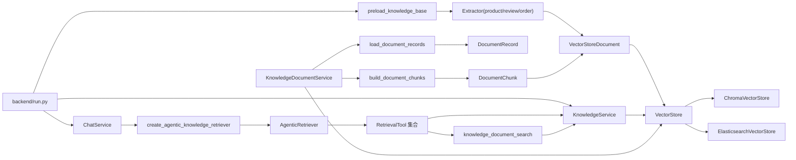
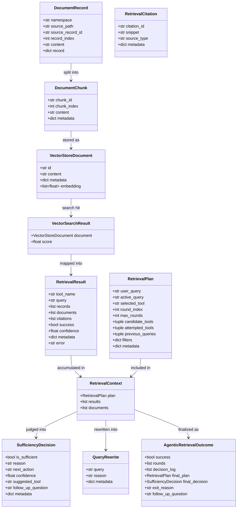
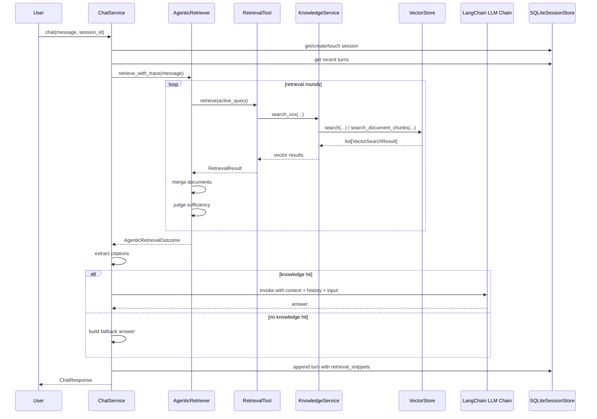
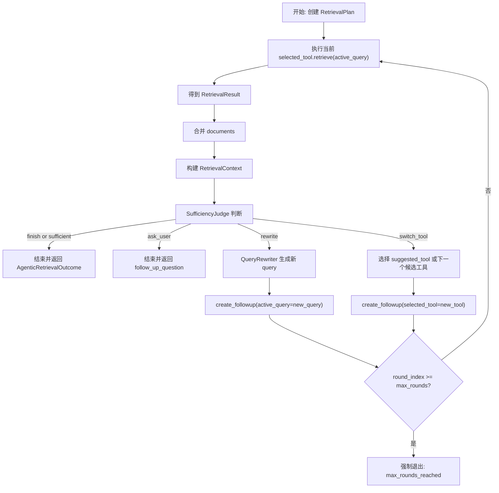
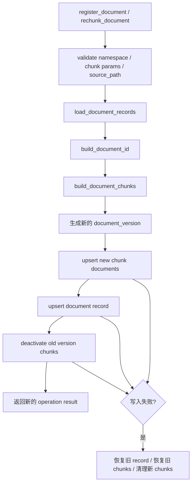

# backend/knowledge 包详细分析

## 1. 分析目标

本文聚焦 `backend/knowledge` 包，并补充它与以下调用方的真实关系：

- `backend/run.py`
- `backend/api/chat/service.py`
- `backend/tools/ecommerce/retrieval.py`
- `backend/api/knowledge/routes.py`

目标不是只解释“每个文件干什么”，而是把下面 3 件事讲清楚：

1. `knowledge` 包内部的模块职责和边界
2. 代码里的核心数据结构如何流动
3. 这个项目当前真实的 RAG 调用流程，尤其是带多轮决策的 Agentic Retrieval

---

## 2. `backend/knowledge` 包的整体职责

`backend/knowledge` 本质上做了 4 层事情：

1. **统一向量存储层**
   - 抽象 `VectorStore`
   - 屏蔽 `Chroma` 和 `Elasticsearch` 的差异

2. **电商知识建模层**
   - 把商品、评价、订单 JSON 记录转换成可检索的向量文档
   - 提供统一的 `KnowledgeService` 查询入口

3. **知识文档管理层**
   - 支持上传的 JSON/TXT/MD/CSV 文档进入知识库
   - 负责分块、版本切换、软删除、重建索引

4. **RAG 编排层**
   - 定义统一的检索结果结构
   - 支持普通检索工具和 Agentic 多轮检索
   - 把“检索工具 -> 结果判断 -> 改写 query / 切换工具”的过程组织起来

可以把它理解成：

- `base/` 负责“怎么存、怎么查”
- `ecommerce/` 负责“查什么业务知识”
- `documents/` 负责“用户上传知识怎么入库”
- `rag/` 负责“怎么把检索组织成可复用的 RAG 流程”

---

## 3. 目录与职责拆解

### 3.1 `backend/knowledge/base`

#### `base/store.py`

这是整个知识层最底层、最核心的文件。

它定义了：

- `VectorStoreDocument`
  - 向量库里的一条标准文档
- `VectorSearchResult`
  - 一次检索命中的标准结果
- `VectorStoreHealth`
  - 存储健康检查结果
- `VectorStore`
  - 抽象基类，约束所有向量后端都要实现的接口
- `ChromaVectorStore`
  - Chroma 实现
- `ElasticsearchVectorStore`
  - Elasticsearch 实现
- `VectorStoreFactory`
  - 根据配置切换 provider
- `HybridSearchRanker`
  - 对“向量结果 + 关键词结果”做混合重排
- `LocalHashingEmbedder`
  - 本地哈希 embedding，实现零外部 embedding 服务依赖

这层的核心价值是：

- 上层业务不用关心底层是 Chroma 还是 Elasticsearch
- 检索结果对上层始终是统一结构
- 文档知识和商品知识都复用同一套向量能力

#### `base/text.py`

主要是文本摘要工具，例如 `truncate_snippet`，用于：

- 把检索命中的长文本压缩成 citation/snippet
- 供回答生成和前端引用展示使用

---

### 3.2 `backend/knowledge/ecommerce`

#### `ecommerce/extractor.py`

负责把业务记录转换成 `VectorStoreDocument`。

包括 3 类转换函数：

- `build_product_document(product)`
- `build_review_document(review)`
- `build_order_document(order)`

它做的不是简单字段映射，而是把结构化 JSON 拼成“适合语义检索”的文本 `content`，同时保留结构化 `metadata`。

例如：

- 商品会把名称、分类、描述、价格、规格、库存拼成一条语义文本
- 评价会把标题、内容、评分、用户、时间拼成文本
- 订单会把订单状态、商品列表、收货地址、物流字段拼成文本

这一步是“结构化业务数据 -> RAG 可检索语料”的入口。

#### `ecommerce/service.py`

`KnowledgeService` 是电商知识检索的统一业务入口。

它封装了：

- `search_products`
- `search_reviews`
- `search_orders`
- `search_document_chunks`
- `upsert_products`
- `upsert_reviews`
- `upsert_orders`
- `delete_documents`

它的定位不是编排 RAG，而是提供一个稳定的知识访问 API：

- 上层不直接操作 `VectorStore`
- 上层只说“搜商品”、“搜评价”、“搜订单”
- namespace 校验也集中放在这里

#### `ecommerce/loader.py`

负责系统启动时，把内置电商知识预加载到向量库：

- `products.json`
- `reviews.json`
- `orders.json`

核心函数是：

- `preload_knowledge_base()`

流程是：

1. 从 `data_dir` 读取 JSON
2. 转成 `VectorStoreDocument`
3. 调用 `store.upsert_documents(...)`

所以它是“冷启动建库器”。

#### `ecommerce/retriever.py`

这是当前项目里最值得讲的文件之一。

它定义了两类东西：

1. 一个普通聚合检索器：`KnowledgeBaseRetriever`
2. 一套面向 Agentic RAG 的判断器与改写器

关键类：

- `KnowledgeBaseRetriever`
  - 同时搜 `products/reviews/orders/document_chunks`
  - 合并结果、去重、按分数排序
- `EcommerceSufficiencyJudge`
  - 判断当前证据是否足够
  - 如果不够，决定下一步是：
    - `finish`
    - `rewrite`
    - `switch_tool`
    - `ask_user`
- `EcommerceQueryRewriter`
  - 对 query 做轻量改写
- `create_agentic_knowledge_retriever`
  - 组装 `AgenticRetriever`

这个文件把“检索”从单次向量查询，升级成了“可多轮决策的检索器”。

---

### 3.3 `backend/knowledge/documents`

这一层负责“用户上传知识文档”的索引管理。

#### `documents/schemas.py`

定义两种关键结构：

- `DocumentRecord`
  - 表示从源文件读取出来的一条原始记录
- `DocumentChunk`
  - 表示经过切块后、可写入向量库的文本块

#### `documents/validators.py`

负责校验：

- `namespace`
- `chunk_size/chunk_overlap`
- `source_path` 必须位于指定根目录下

重点是 `validate_source_path()`，它明确限制路径不能逃逸 `data_root`，这是文档管理里一个重要安全点。

#### `documents/loader.py`

负责把源文件变成 `DocumentRecord`。

支持：

- `.json`
- `.txt`
- `.md`
- `.csv`

核心能力：

- `build_document_id(namespace, source_path)`
  - 基于 namespace + 路径生成稳定 document_id
- `build_source_record_id(source_path, record, index)`
  - 为源记录生成稳定 record id
- `load_document_records(...)`
  - 根据文件类型解析记录

这一步是“文件 -> 记录”的转换。

#### `documents/chunker.py`

负责把 `DocumentRecord` 切成 `DocumentChunk`。

核心函数：

- `build_document_chunks(...)`

做的事情：

1. 按 `chunk_size/chunk_overlap` 线性切块
2. 为每个 chunk 生成稳定 `chunk_id`
3. 生成追踪 metadata

这里的 metadata 很关键，至少会带：

- `document_id`
- `document_version`
- `namespace`
- `source_path`
- `source_record_id`
- `chunk_index`
- `updated_at`

#### `documents/service.py`

这是上传文档知识库的主服务层。

核心职责：

- 注册文档
- 列出文档
- 列出文件索引状态
- 获取文档详情
- 删除文档
- 重新分块并重建版本

关键类：

- `KnowledgeDocumentService`
- `KnowledgeDocumentSummary`
- `KnowledgeDocumentDetail`
- `KnowledgeDocumentOperationResult`
- `KnowledgeDocumentVersionSummary`
- `KnowledgeFileIndexSummary`

最重要的方法是：

- `register_document(...)`
- `rechunk_document(...)`
- `_write_new_version(...)`

其中 `_write_new_version()` 是整套文档索引切换的事务核心：

1. 读源文件
2. 切块
3. 生成新的 document version
4. 写入新 chunk
5. 写入 document record
6. 停用旧 version 的 chunk
7. 失败时做回滚和补偿清理

所以这层不是简单上传文件，而是带“版本化索引切换”的管理服务。

---

### 3.4 `backend/knowledge/rag`

#### `rag/core.py`

这里定义的是 RAG 编排协议，而不是电商业务本身。

关键结构：

- `RetrievalCitation`
- `RetrievalResult`
- `RetrievalPlan`
- `SufficiencyDecision`
- `QueryRewrite`
- `RetrievalContext`
- `RetrievalDecisionLogEntry`
- `RetrievalTool`
- `SufficiencyJudge`
- `QueryRewriter`

它提供的是一套统一协议：

- 检索工具必须返回什么
- 判断器必须输入什么、输出什么
- 改写器必须输入什么、输出什么
- 多轮检索的状态如何表达

这相当于给 Agentic RAG 定了一套“中间语言”。

#### `rag/agentic.py`

`AgenticRetriever` 是这套项目里真正的检索编排器。

它维护一个 `RetrievalPlan`，然后循环：

1. 用当前工具执行检索
2. 合并 documents
3. 调用 `SufficiencyJudge`
4. 根据判断决定：
   - 结束
   - 改写 query
   - 切换工具
   - 反问用户
5. 写入 trace 和 decision log

最终返回 `AgenticRetrievalOutcome`，里面包含：

- 最终 documents
- 每一轮结果
- 决策日志
- 退出原因
- 是否需要追问用户

这一层实现的不是“检索一次”，而是“有状态的检索会话”。

---

## 4. 代码中的核心数据结构

下面按“从底层到上层”的顺序整理。

### 4.1 向量存储层

#### `VectorStoreDocument`

```python
class VectorStoreDocument(BaseModel):
    id: str
    content: str
    metadata: dict[str, Any] = Field(default_factory=dict)
    embedding: list[float] | None = None
```

作用：

- 所有要写入向量库的对象，最后都要变成这个结构

典型来源：

- 商品文档
- 评价文档
- 订单文档
- 文档 chunk

#### `VectorSearchResult`

```python
class VectorSearchResult(BaseModel):
    document: VectorStoreDocument
    score: float | None = None
```

作用：

- `VectorStore.search()` 的统一输出
- 不论底层是 Chroma 还是 Elasticsearch，最后都转成这个结构

#### `VectorStore`

它定义了两类能力：

1. 基础知识检索能力
   - `ensure_collections`
   - `upsert_documents`
   - `search`
   - `delete_documents`
   - `healthcheck`

2. 文档知识管理能力
   - `ensure_document_indexes`
   - `upsert_document_record`
   - `get_document_record`
   - `list_document_records`
   - `search_document_chunks`
   - `delete_document_record`
   - `upsert_document_chunks`
   - `deactivate_document_chunks`
   - `activate_document_chunks`
   - `delete_document_chunks`

这说明当前项目把“商品知识库”和“上传文档知识库”都放进了统一的存储抽象里。

---

### 4.2 文档管理层

#### `DocumentRecord`

```python
class DocumentRecord(BaseModel):
    namespace: str
    source_path: str
    source_record_id: str
    record_index: int
    content: str
    record: dict[str, Any] = Field(default_factory=dict)
```

作用：

- 表示从源文件读取出的单条原始记录

适用场景：

- JSON 数组中的一项
- CSV 中的一行
- TXT/MD 被包装成一条记录

#### `DocumentChunk`

```python
class DocumentChunk(BaseModel):
    chunk_id: str
    chunk_index: int
    content: str
    metadata: dict[str, Any] = Field(default_factory=dict)
```

作用：

- 表示切块后、准备写入向量库的片段

它最后通常会再被包装成：

- `VectorStoreDocument(id=chunk_id, content=chunk.content, metadata=...)`

#### 文档主记录 `record`

`KnowledgeDocumentService` 内部维护的文档主记录是普通 `dict[str, object]`，不是单独的 Pydantic 实体。

核心字段包括：

- `document_id`
- `namespace`
- `source_type`
- `source_path`
- `status`
- `active_version`
- `chunk_count`
- `chunk_size`
- `chunk_overlap`
- `created_at`
- `updated_at`
- `last_error`
- `versions`

其中 `versions` 记录版本历史，每个版本包含：

- `document_version`
- `status`
- `chunk_count`
- `chunk_size`
- `chunk_overlap`
- `created_at`
- `last_error`

也就是说，文档知识库这里用了：

- 主记录保存“当前激活版本”
- chunks 保存“具体检索内容”
- version 列表保存“历史版本轨迹”

---

### 4.3 RAG 编排层

#### `RetrievalCitation`

```python
class RetrievalCitation(BaseModel):
    citation_id: str
    snippet: str
    source_type: str | None = None
    metadata: dict[str, Any] = Field(default_factory=dict)
```

作用：

- 给最终回答提供可引用的证据片段

#### `RetrievalResult`

```python
class RetrievalResult(BaseModel):
    tool_name: str
    query: str
    records: list[dict[str, Any]]
    documents: list[Document]
    citations: list[RetrievalCitation]
    success: bool
    confidence: float | None
    metadata: dict[str, Any]
    error: str | None
```

作用：

- 任意检索工具的标准输出

很重要的一点是，它同时保留了 3 个视角：

- `records`
  - 给程序逻辑看，偏结构化
- `documents`
  - 给 LangChain / LLM 上下文看
- `citations`
  - 给前端 / 回答引用看

#### `RetrievalPlan`

表示当前这轮检索计划。

关键字段：

- `user_query`
- `active_query`
- `selected_tool`
- `round_index`
- `max_rounds`
- `candidate_tools`
- `attempted_tools`
- `previous_queries`
- `filters`
- `metadata`

可以把它理解为“Agentic 检索的状态机上下文”。

#### `SufficiencyDecision`

表示判断器的输出。

关键字段：

- `is_sufficient`
- `reason`
- `next_action`
- `confidence`
- `suggested_tool`
- `follow_up_question`
- `metadata`

其中 `next_action` 只有四种：

- `finish`
- `rewrite`
- `switch_tool`
- `ask_user`

#### `QueryRewrite`

表示 query 改写结果。

关键字段：

- `query`
- `reason`
- `metadata`

#### `RetrievalContext`

表示当前判断器/改写器看到的完整上下文：

- 当前 plan
- 所有历史 result
- 当前已累计 documents

#### `AgenticRetrievalOutcome`

是一次完整 agentic retrieval 会话的输出。

包含：

- `success`
- `rounds`
- `decision_log`
- `final_plan`
- `final_decision`
- `exit_reason`
- `follow_up_question`

这说明这个项目不只是拿检索结果，还把“检索过程本身”保留下来了。

---

## 5. 从启动到可检索：知识如何进入系统

### 5.1 内置电商知识预加载流程

启动入口在 `backend/run.py`：

1. `create_knowledge_service()`
2. `preload_knowledge_base(...)`
3. `create_chat_service(...)`

其中 `preload_knowledge_base()` 会：

1. 读取 `products.json`
2. 读取 `reviews.json`
3. 读取 `orders.json`
4. 调用 extractor 转成 `VectorStoreDocument`
5. 写入 `products/reviews/orders` namespace

这里的意义是：

- 服务启动时就把电商演示数据建好
- 聊天接口第一次调用时不需要现场建库

---

## 6. `KnowledgeService` 的真实位置

`KnowledgeService` 是整个知识层对业务层暴露的主入口。

它位于中间层：

- 下游依赖：`VectorStore`
- 上游调用：`ChatService`、检索工具层、测试代码

它不做的事情：

- 不负责多轮编排
- 不负责模型回答
- 不负责会话存储

它负责的事情：

- 隔离 namespace 和 provider 细节
- 提供面向业务的查询动作
- 统一 upsert / search / delete 行为

所以它是一个非常标准的“知识访问服务层”。

---

## 7. 当前项目的 RAG 主流程

### 7.1 聊天入口

真正的在线 RAG 入口不是 `knowledge` 包本身，而是：

- `backend/api/chat/service.py`

`ChatService.chat()` 的主流程是：

1. 校验 session
2. 读取历史对话
3. 构建 agentic retriever
4. 对用户消息执行 `retrieve_with_trace()`
5. 从 documents 抽取 citations
6. 如果有知识命中，则调用 LLM 生成答案
7. 把问答与 retrieval snippets 写入 SQLite
8. 返回响应

注意：这里的知识检索发生在 **LLM 生成之前**，是典型的检索增强回答。

---

### 7.2 检索工具集合

`create_agentic_knowledge_retriever()` 会先构建工具集：

- `product_semantic_search`
- `review_semantic_search`
- `order_semantic_search`
- `knowledge_document_search`
- `inventory_lookup`
- `product_detail_lookup`

这 6 个工具里其实有两类：

1. **语义检索工具**
   - 从向量库查语义相似内容
   - 例如商品、评价、订单、文档 chunk

2. **精确查询工具**
   - 查本地 JSON 结构化字段
   - 例如库存、商品详情

这就形成了一个很实用的混合模式：

- 先用语义检索找候选商品
- 再切换到结构化查询拿精确信息

这正是电商客服场景里常见的“先召回，再补全”。

---

### 7.3 单个检索工具是怎么工作的

以 `product_semantic_search` 为例：

1. 调 `KnowledgeService.search_products()`
2. 下钻到 `VectorStore.search(namespace="products", ...)`
3. 返回 `list[VectorSearchResult]`
4. 经 `build_retrieval_result(...)` 转成：
   - `records`
   - `documents`
   - `citations`
   - `confidence`

这里非常关键：

- 向量层返回的是 `VectorSearchResult`
- RAG 层消费的是 `RetrievalResult`

也就是：

**底层检索结果** 和 **上层 RAG 结果** 被明确分层了

---

### 7.4 `AgenticRetriever` 的多轮决策流程

`AgenticRetriever.retrieve_with_trace()` 的核心循环如下：

1. 选定当前工具 `selected_tool`
2. 执行当前工具的 `retrieve()`
3. 合并累计 `documents`
4. 生成 `RetrievalContext`
5. 调用 `SufficiencyJudge`
6. 根据 `next_action` 执行：
   - `finish`
   - `rewrite`
   - `switch_tool`
   - `ask_user`
7. 直到结束或达到 `max_rounds`

这个逻辑使得检索不再是一次性的，而是类似一个轻量 Agent。

---

### 7.5 当前项目里的判断策略

`EcommerceSufficiencyJudge` 不是 LLM judge，而是规则型 judge。

它根据 query 关键词和当前结果做决策，例如：

- 用户问“有货吗 / 库存”
  - 先用商品语义检索找候选商品
  - 再切到 `inventory_lookup`

- 用户问“参数 / 规格 / 价格”
  - 先找商品
  - 再切到 `product_detail_lookup`

- 用户问“评价 / 口碑”
  - 切到 `review_semantic_search`

- 用户问“订单 / 物流”
  - 切到 `order_semantic_search`

- 电商内置知识没命中
  - 切到 `knowledge_document_search`

- 还是没有结果
  - 改写 query 或追问用户

这套逻辑说明当前项目的 Agentic RAG 重点不是“复杂推理”，而是：

- 基于业务场景做工具路由
- 基于结果是否充分做下一步检索动作

---

### 7.6 Query Rewrite 的作用

`EcommerceQueryRewriter` 做的是轻量规则改写，不是生成式重写。

例如把：

- “有没有货” -> “库存”
- “值得买吗” -> “评价”
- “怎么样” -> “参数 评价”

如果没有明显可替换模式，就在原 query 后追加：

- 商品
- 参数
- 评价
- 文档

目的很明确：

- 扩大召回面
- 提高下一轮检索成功率

---

### 7.7 文档知识如何参与 RAG

用户上传的知识文档并不和商品、评价、订单混在一个 namespace 里。

当前实现是分两层：

1. 文档管理主记录
   - `documents`
2. 文档 chunk 索引
   - `chunks`

在 RAG 时真正参与召回的是：

- `KnowledgeService.search_document_chunks()`

也就是说：

- 文档主记录负责管理
- 文档 chunk 负责检索

并且当前对文档 chunk 的搜索，会限定：

- `is_active = True`
- 可选 `namespace` 过滤

所以被删除或被旧版本替换的 chunk，不会再参与在线 RAG。

---

## 8. 当前项目的“RAG 流程”可以怎么讲

如果从面试或项目讲解角度，可以概括为以下链路：

1. **离线准备**
   - 电商 JSON 预加载到向量库
   - 上传知识文档切块后写入文档 chunk 索引

2. **在线召回**
   - 聊天请求先进入 `AgenticRetriever`
   - 默认从商品语义检索开始
   - 根据 query 类型和结果充分性切换检索工具

3. **证据聚合**
   - 各工具输出统一的 `RetrievalResult`
   - 聚合成 `documents + citations`

4. **回答生成**
   - 命中的 documents 输入到 LangChain `stuff documents chain`
   - 与用户问题、对话历史一起送入 LLM

5. **会话落库**
   - citations 以 `retrieval_snippets` 形式持久化到 SQLite

这个链路比“单次向量搜索 + LLM 回答”的普通 RAG 稍微进了一步，因为它有：

- 多知识源
- 多检索工具
- 多轮路由决策
- 文档版本管理

---

## 9. 关键设计亮点

### 9.1 把存储层和业务层隔离开了

通过 `VectorStore` + `VectorStoreFactory`：

- 业务代码不依赖具体 provider
- Chroma 和 Elasticsearch 共用统一接口

### 9.2 把“底层检索结果”和“RAG 结果”分层

底层是：

- `VectorSearchResult`

上层是：

- `RetrievalResult`

这样上层可以独立组织 citations、documents、confidence，而不受底层向量引擎限制。

### 9.3 把“语义召回”和“精确查询”结合起来了

典型例子：

- 商品语义检索找候选
- `inventory_lookup` / `product_detail_lookup` 查精确信息

这比纯向量检索更贴近真实客服系统。

### 9.4 文档知识库支持版本化切换

`KnowledgeDocumentService` 在文档重建时不是直接覆盖，而是：

- 新版本 chunks 先写入
- 主记录切到新版本
- 旧版本 chunks 停用
- 失败时补偿清理

这让上传知识文档的管理更稳。

### 9.5 文档检索做了混合重排

`search_document_chunks()` 不只是向量搜索。

在 Chroma 和 Elasticsearch 实现里都会：

1. 先做向量召回
2. 再找关键词候选
3. 用 `HybridSearchRanker` 合并排序

这对短问句、关键词明确的问题更友好。

---

## 10. 当前实现中的几个边界与注意点

### 10.1 当前 Agentic Judge 是规则型，不是模型型

优点：

- 简单、稳定、可控

限制：

- 复杂 query 的理解能力有限
- 工具选择依赖人工维护关键词

### 10.2 本地 embedding 是哈希向量，不是真实语义 embedding

`LocalHashingEmbedder` 的优点是：

- 零外部依赖
- 方便本地跑通 MVP

限制是：

- 语义表达能力远弱于真实 embedding 模型
- 更适合演示和最小可运行链路

### 10.3 文档 source_type 当前写得比较固定

在 `documents/service.py` 和 `documents/chunker.py` 中，`source_type` 当前更像固定占位字段。

如果后续真的要支持：

- PDF
- DOCX
- XLSX

还需要补齐真实解析与类型标注链路。

### 10.4 ChatService 当前主要使用 citations 驱动“是否命中知识”

也就是说，RAG 是否生效目前判断标准比较直接：

- `documents -> citations`
- citations 非空就进入回答链

这适合 MVP，但后续也可以加：

- 最低分阈值
- 命中来源策略
- namespace 白名单

---

## 11. Mermaid 图

### 11.1 模块关系图



### 11.2 核心数据结构图



### 11.3 在线 Chat + RAG 时序图



### 11.4 Agentic Retrieval 决策流程图



### 11.5 上传文档索引流程图



---

## 12. 一句话总结

`backend/knowledge` 当前已经不是一个“简单向量检索工具包”，而是一个包含：

- 向量存储抽象
- 电商知识建模
- 上传文档索引管理
- Agentic 多轮检索编排

的完整知识层。

如果用项目语言概括，它承接的是：

**“知识进入系统 -> 知识被索引 -> 知识被多轮路由召回 -> 证据进入 LLM -> 回答落到会话记忆”** 这一整条最小可运行 RAG 链路。
