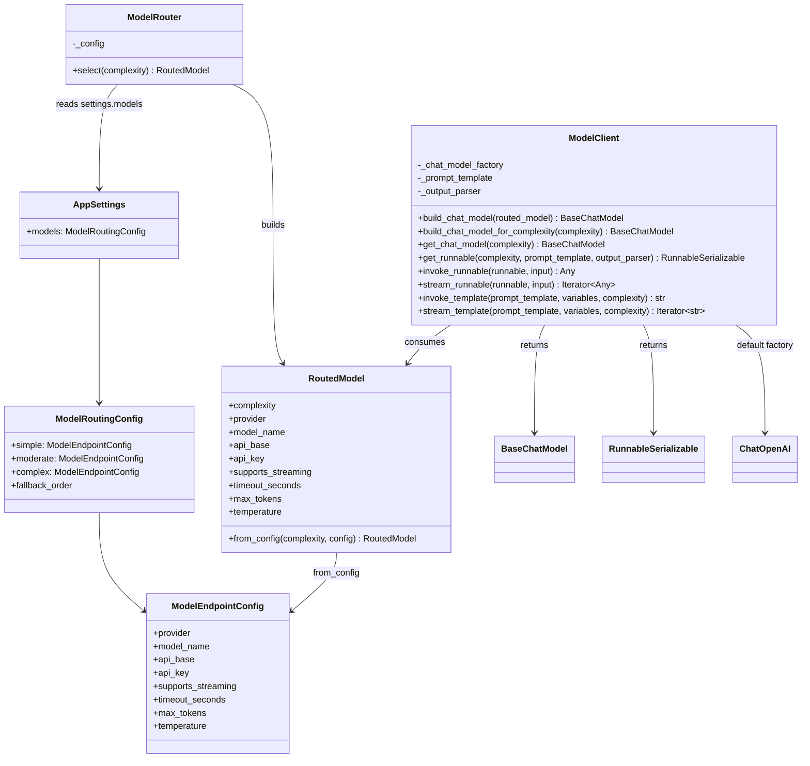
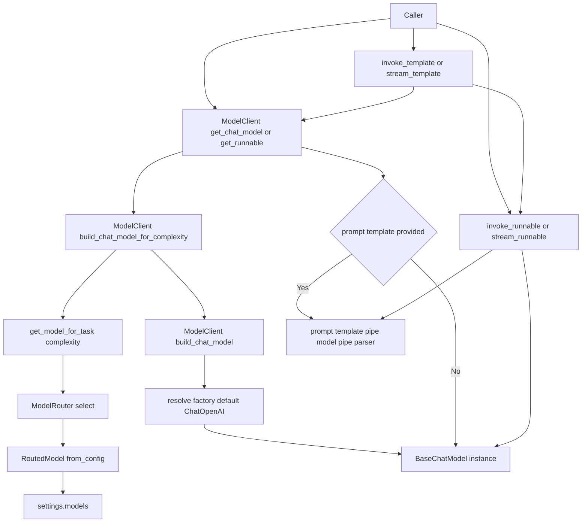

# `backend/platform/models`

`platform.models` 是平台里的模型访问适配层，负责把“按复杂度选择模型配置”与“用 LangChain LCEL 执行模型调用”隔离开。

当前这层的定位是：

- 上游只声明任务复杂度 `simple / moderate / complex`
- 中间由 `ModelRouter` 从配置中选出对应模型
- 再由 `ModelClient` 构造 LangChain `BaseChatModel` 或 `Runnable`
- 最终供 runtime、agent 或后续 LangGraph 链路复用

这层现在是 **LCEL First**：

- 主接口是 `get_chat_model()` 和 `get_runnable()`
- `invoke_runnable()` / `stream_runnable()` 是统一执行入口
- `invoke_template()` / `stream_template()` 只是兼容 helper

它不负责：

- memory / session / history 注入
- `RunnableWithMessageHistory` 装配
- scene 级 prompt 编排

## 包内结构

- `base/router.py`
  - 负责模型路由
  - 把 `settings.models` 中的配置映射成 `RoutedModel`
- `llm/client.py`
  - 负责 LangChain 模型实例构造、LCEL runnable 组装与执行封装
  - 对外提供 `get_chat_model()`、`get_runnable()`、`invoke_runnable()`、`stream_runnable()` 等入口
- `__init__.py`
  - 当前仅保留兼容导出

## 类关系图

## 调用链路图

## 关键职责

### `RoutedModel`

`RoutedModel` 是“路由结果对象”。

它不是配置源本身，而是把 `ModelEndpointConfig` 转成调用层可以直接消费的只读结构，避免上层直接依赖配置对象。

### `ModelRouter`

`ModelRouter` 只负责按复杂度，从 `settings.models` 里选出模型配置。

这一层不关心 LangChain prompt，不关心 memory，也不直接发请求。

### `ModelClient`

`ModelClient` 负责三件事：

- 把 `RoutedModel` 构造成 LangChain `BaseChatModel`
- 组装 LCEL runnable
- 通过统一执行入口运行 runnable

推荐调用顺序是：

1. 用 `get_chat_model()` 拿到底层 `BaseChatModel`
2. 或用 `get_runnable()` 组装 `prompt -> model -> parser` 链
3. 再用 `invoke_runnable()` / `stream_runnable()` 执行

如果上游还没迁移完，也可以继续使用：

- `invoke_template()`
- `stream_template()`
- `invoke()`
- `stream()`

但这些方法只是对 runnable 路径的兼容封装，不再是主设计中心。

## 当前设计边界

- 这层已经把“模型路由”和“模型执行”拆开
- 当前默认工厂仍是 `langchain_openai.ChatOpenAI`
- `provider` 字段已进入路由结果，但当前执行仍走 OpenAI-compatible 路线

因此它现在更准确的定位是：

- “复杂度驱动的 OpenAI-compatible LangChain 执行层”
- 不是“完整的多 Provider 模型抽象层”

## 对调用方的建议

- 如果你在写新链路，优先使用 `get_chat_model()` / `get_runnable()`
- 如果你在迁移旧链路，可以暂时保留 `invoke_template()` / `stream_template()`
- 如果你要做 memory/history，应该在上游 runtime 或 LangGraph 层完成，不要塞回 `platform.models`
