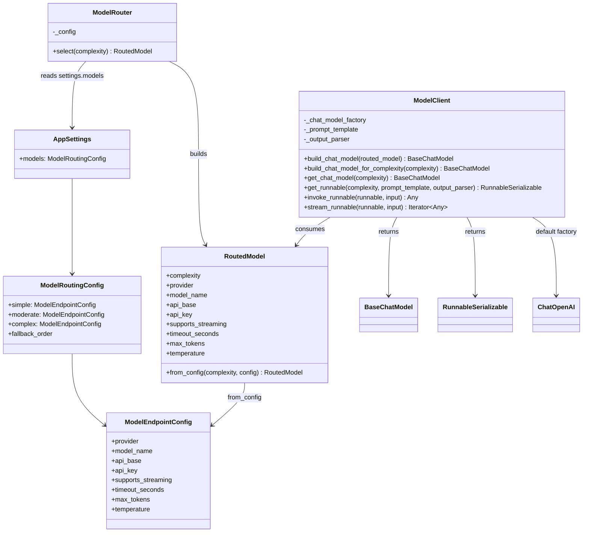
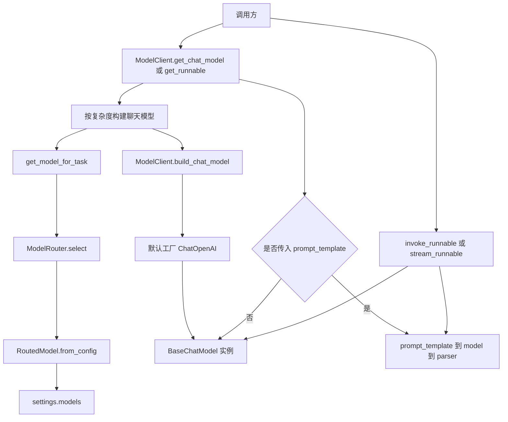

# `backend/platform/models`

`platform.models` 是项目里的“模型入口”。它解决一个问题：

> 业务代码只说这次任务有多复杂，模型包负责选模型、创建 LangChain 模型对象，并提供统一调用入口。

也就是说，调用方不需要到处写 API Key、模型名、base_url，也不需要每个模块都自己 new 一个 LangChain 模型。

## 先用一句话理解 LangChain

LangChain 可以先理解成一个“把大模型调用标准化”的 Python 工具箱。

在本项目里，你先掌握 4 个概念就够了：

- `ChatOpenAI`
  - LangChain 提供的聊天模型实现。
  - 名字叫 OpenAI，但它支持 OpenAI-compatible 接口，所以这里也能接 DashScope 的兼容模式。
- `BaseChatModel`
  - LangChain 对“聊天模型”的统一抽象。
  - `ChatOpenAI` 创建出来的对象就是一种 `BaseChatModel`。
- `PromptTemplate`
  - 提示词模板。
  - 例如 `"请回答：{question}"`，运行时传入 `{"question": "..."}`。
- `Runnable`
  - LangChain 里“可以被执行的东西”。
  - prompt、model、parser 都可以像管道一样串起来：`prompt | model | parser`。

这条管道叫 LCEL，意思是 LangChain Expression Language。你不用把它想复杂，它在代码里就是用 `|` 把步骤串起来。

## 这个包当前的真实结构

```text
backend/platform/models/
├── __init__.py
├── README.md
├── base/
│   ├── __init__.py
│   └── router.py
└── llm/
    ├── __init__.py
    └── client.py
```

### `base/router.py`

这一层只负责“选模型”，不调用模型。

它提供：

- `TaskComplexity`
  - 任务复杂度类型：`simple`、`moderate`、`complex`。
- `RoutedModel`
  - 一次路由后的模型信息。
  - 包含 `provider`、`model_name`、`api_base`、`api_key`、`supports_streaming`、`timeout_seconds`、`max_tokens`、`temperature`。
- `ModelRouter`
  - 从 `settings.models` 里按复杂度取出对应配置。
- `get_model_for_task(complexity)`
  - 模块级快捷函数。

简单说：

```python
get_model_for_task("simple")
```

会得到一个 `RoutedModel`，它描述“simple 任务应该用哪个模型、怎么连这个模型”。

### `llm/client.py`

这一层负责“把路由结果变成 LangChain 可执行对象”，并提供统一执行方法。

它提供：

- `ModelClient.build_chat_model(routed_model)`
  - 把 `RoutedModel` 变成 LangChain 的 `BaseChatModel`。
  - 默认实际创建的是 `langchain_openai.ChatOpenAI`。
- `ModelClient.get_chat_model(complexity)`
  - 先路由，再返回聊天模型对象。
- `ModelClient.get_runnable(complexity, prompt_template=None, output_parser=None)`
  - 不传 `prompt_template`：直接返回聊天模型。
  - 传了 `prompt_template`：返回 `prompt -> model -> parser` 这条 LangChain 管道。
- `ModelClient.invoke_runnable(runnable, input)`
  - 同步执行 runnable。
  - 如果模型返回空内容，会抛 `ValueError`。
- `ModelClient.stream_runnable(runnable, input)`
  - 流式执行 runnable。
  - 会过滤空 chunk。

文件底部还有一个全局实例：

```python
model_client = ModelClient()
```

业务代码通常直接复用它。

## 配置从哪里来

模型名和 base URL 来自：

```text
backend/platform/config/model_routing.json
```

API Key 来自环境变量或 `backend/.env`：

```env
AI_RAG_MODELS__SIMPLE__API_KEY=your-dashscope-api-key
AI_RAG_MODELS__MODERATE__API_KEY=your-dashscope-api-key
AI_RAG_MODELS__COMPLEX__API_KEY=your-dashscope-api-key
```

这些配置会在 `backend/platform/config/settings.py` 里组装成：

```python
settings.models
```

然后 `ModelRouter` 读取 `settings.models`。

## 一次完整调用是怎么发生的

以 runtime 里生成 RAG 答案为例，调用链大致是：

```text
ChatService
  -> model_client.get_runnable("simple", prompt_template=...)
  -> get_model_for_task("simple")
  -> ModelRouter.select("simple")
  -> RoutedModel
  -> ChatOpenAI(...)
  -> prompt | model | StrOutputParser()
  -> model_client.invoke_runnable(...)
```

对应到 LangChain，就是这件事：

```python
runnable = prompt_template | chat_model | output_parser
answer = runnable.invoke(variables)
```

如果是流式输出，就是：

```python
for chunk in runnable.stream(variables):
    ...
```

本项目把这些细节包进了 `ModelClient`，所以调用方不用重复写。

## 最小示例

### 直接拿聊天模型

```python
from backend.platform.models.llm.client import model_client

chat_model = model_client.get_chat_model("simple")
response = chat_model.invoke("hello")
```

这里拿到的是 LangChain 的 `BaseChatModel`，可以继续交给 Agent、LangGraph 或其他 LangChain 组件。

### 使用 prompt 管道

```python
from langchain_core.prompts import PromptTemplate

from backend.platform.models.llm.client import model_client

prompt = PromptTemplate.from_template("请用一句话回答：{question}")
runnable = model_client.get_runnable(
    complexity="simple",
    prompt_template=prompt,
)

answer = model_client.invoke_runnable(
    runnable,
    {"question": "LangChain 是什么？"},
)
```

这等价于：

```python
prompt -> model -> StrOutputParser
```

其中 `StrOutputParser` 会把模型返回的消息对象转成普通字符串。

### 流式输出

```python
from langchain_core.prompts import PromptTemplate

from backend.platform.models.llm.client import model_client

prompt = PromptTemplate.from_template("请列出 3 个要点：{topic}")
runnable = model_client.get_runnable("simple", prompt_template=prompt)

for chunk in model_client.stream_runnable(runnable, {"topic": "RAG"}):
    print(chunk, end="")
```

如果使用旧 helper，也可以：

```python
for chunk in model_client.stream("hello", complexity="simple"):
    print(chunk, end="")
```

但新代码更推荐显式使用 `get_runnable()`、`invoke_runnable()` 和 `stream_runnable()`。

## 类关系图



## 调用链路图



## 这层不负责什么

`platform.models` 只负责模型路由和模型调用入口。下面这些事情在别的层做：

- 会话、历史消息、窗口裁剪
  - 在 `backend/platform/memory/` 和 runtime 中处理。
- prompt history
  - 由 ChatGraph checkpoint 与 application 层显式变量传递，不在模型包里装配。
- scene prompt 和检索策略
  - 在 `backend/scenes/` 和 runtime 中处理。
- 文档检索、Hybrid Search、Agentic Retrieval
  - 在 `backend/platform/rag/` 中处理。

这样的好处是：模型包只回答“用哪个模型、怎么调模型”，不关心一次聊天业务到底怎么组织。

## 当前边界和注意点

- 当前默认模型工厂是 `langchain_openai.ChatOpenAI`。
- `provider` 字段已经进入 `RoutedModel`，但 `ModelClient` 还没有按 provider 分发不同 SDK。
- 所以当前更准确的定位是：
  - “按复杂度路由的 OpenAI-compatible LangChain 模型层”。
  - 还不是完整的多 provider 模型抽象层。
- `model_routing.json` 里的 `task_types`、`fallback` 当前主要是配置语义说明，`ModelRouter.select()` 现在只按 `simple / moderate / complex` 取配置，没有执行 fallback 逻辑。

## 写新代码时怎么选入口

- 想把模型交给 LangChain、Agent 或 LangGraph：
  - 用 `get_chat_model()`。
- 想构造一条 `prompt -> model -> parser` 链：
  - 用 `get_runnable()`。
- 想执行链：
  - 用 `invoke_runnable()` 或 `stream_runnable()`。
- 想用默认文本 prompt 快速调用：
  - 用 `invoke()` 或 `stream()`。

优先记住这条主线就够了：

```text
complexity -> RoutedModel -> ChatOpenAI/BaseChatModel -> Runnable -> invoke/stream
```
