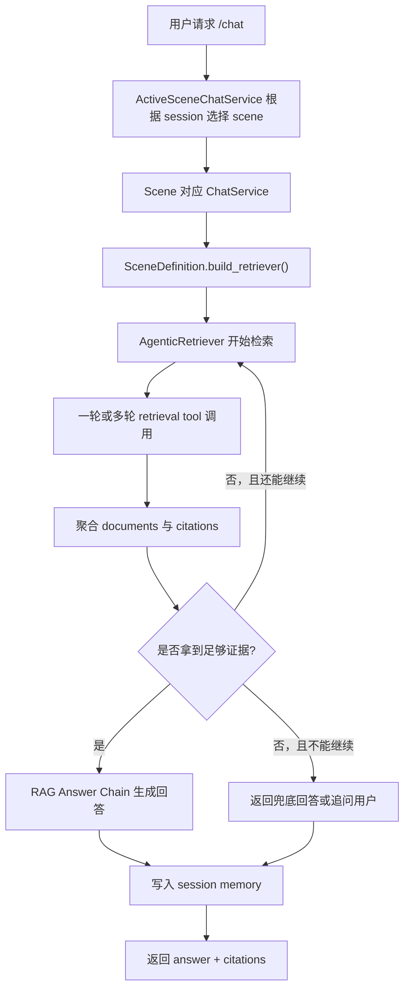
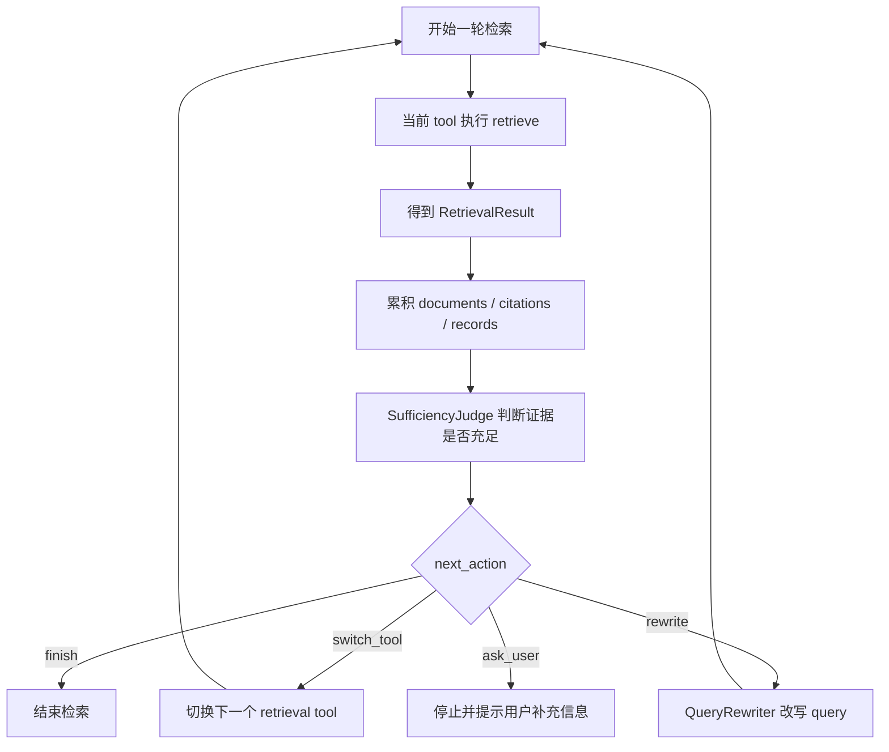
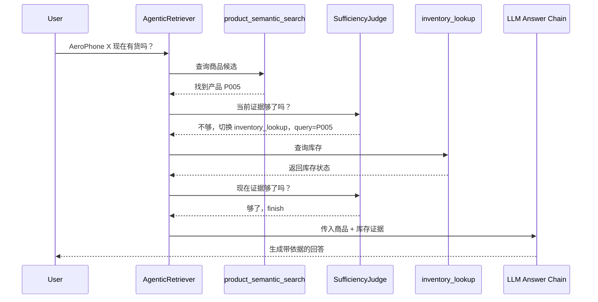
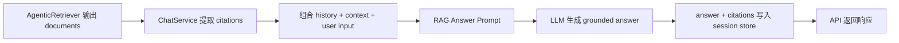

# Agentic RAG 设计说明

这份文档面向项目使用者、开发者和阅读仓库代码的人，解释本项目中的 Agentic RAG 是怎么工作的，以及它和普通 RAG 的区别是什么。

把“检索为什么要多轮、什么时候要换工具、什么时候要改写查询、最后怎么把证据交给大模型回答”讲清楚。

## 1. 什么是 Agentic RAG

先说结论：

- 普通 RAG 更像“查一次资料，然后直接回答”
- Agentic RAG 更像“先查一轮，如果证据不够，就继续想办法补查，直到能回答或者确认现在答不了”

也就是说，Agentic RAG 的重点不只是“召回”，而是“围绕召回做决策”。

它会做的事情包括：

- 选择先用哪个检索工具
- 判断当前证据够不够
- 不够时决定下一步动作
- 必要时切换工具
- 必要时改写 query 再查一轮
- 到达上限后停止，并提示用户补充信息

在这个项目里，Agentic RAG 主要用于 `ecommerce` 场景。

## 2. 为什么它比普通 RAG 更适合复杂问题

普通 RAG 适合的问题通常比较直接，比如：

- “公司退货政策是什么？”
- “这份文档里有没有提到 API 限流？”

这类问题通常一次向量检索就可能拿到足够的上下文。

但在电商或多知识源场景里，用户问题往往不是单一知识源就能解决的，比如：

- “AeroPhone X 现在有货吗？”
- “这款手机值不值得买？”
- “这个产品的参数和价格是什么？”

这类问题背后往往会拆成多个步骤：

1. 先找到用户说的是哪个商品
2. 再根据商品 ID 去查库存、详情或评价
3. 如果平台内置知识不够，再补查用户上传文档
4. 如果还是不够，再提示用户补充信息

这就是 Agentic RAG 的价值：它让检索过程变成一个会思考的链路，而不是一次性的查库动作。

## 3. 本项目里的整体链路

用户请求进入系统后，并不是直接把问题扔给模型，而是先走场景绑定的检索链。

整体链路如下：



如果只看一句话，这个项目里的 Agentic RAG 可以概括为：

“先检索，边检索边判断，必要时补查，最后再让模型基于证据回答。”

## 4. 和普通 RAG 的关键区别

普通 RAG 的思路一般是：

```text
用户问题 -> 检索 -> 拿到文档 -> 模型回答
```

本项目里的 Agentic RAG 是：

```text
用户问题 -> 选择工具 -> 检索 -> 判断够不够
        -> 不够则切换工具 / 改写 query / 追问用户
        -> 聚合证据 -> 模型回答
```

区别不在“有没有向量检索”，而在“检索阶段有没有决策能力”。

## 5. 召回过程是怎么做的

这一部分是本文重点。

### 5.1 第一步：确定当前场景的 Retriever

在本项目里，不同场景有不同的检索实现：

- `generic_assistant`：偏普通文档检索
- `ecommerce`：使用 Agentic RAG

`/chat` 请求进入后，运行时会先根据会话绑定的 `scene` 找到对应的 `ChatService`，再由场景定义生成对应的 `retriever`。

对于 `ecommerce` 场景，会构建一个 `AgenticRetriever`。

对应代码位置：

- `backend/application/runtime/service.py`
- `backend/scenes/ecommerce/definition.py`

### 5.2 第二步：选择默认检索工具开始第一轮召回

`AgenticRetriever` 本身并不直接查数据，它负责“编排”。

真正执行检索的是一组 retrieval tools。  
在电商场景下，当前主要有这些工具：

- `product_semantic_search`
- `review_semantic_search`
- `order_semantic_search`
- `inventory_lookup`
- `product_detail_lookup`
- `knowledge_document_search`

其中：

- `product/review/order semantic search` 主要做语义召回
- `inventory_lookup` 和 `product_detail_lookup` 更像结构化精查
- `knowledge_document_search` 用来补查用户上传文档

默认第一轮从 `product_semantic_search` 开始。

这很符合电商问答的常见模式：先搞清楚用户问的是哪个商品，再决定后续怎么补查。

## 6. 多轮检索闭环

Agentic RAG 的核心就在这里。

每完成一轮检索，系统不会立刻回答，而是会做一次“充足性判断”。

判断结果有四种动作：

- `finish`：证据够了，可以结束检索
- `switch_tool`：当前工具不够，需要换一个工具继续查
- `rewrite`：query 太弱了，需要改写后重查
- `ask_user`：当前证据不足，而且已经没有合适的继续方式，应该请用户补充信息

流程如下：



### 6.1 finish

如果当前证据已经足够支撑一个可信答案，就结束检索，把所有聚合好的文档交给后面的回答链。

### 6.2 switch_tool

这是本项目里最重要的动作之一。

比如用户问：

`AeroPhone X 现在有货吗？`

第一轮通常会先用 `product_semantic_search` 找到候选商品。  
但“是否有货”并不是商品语义描述本身最适合回答的内容，所以系统会继续切换到 `inventory_lookup`。

这类“先找到对象，再查结构化信息”的模式，就是 Agentic RAG 的典型行为。

### 6.3 rewrite

如果当前 query 太模糊、召回为空，或者 judge 认为“这个问题需要换一种搜索表达”，系统会调用 `QueryRewriter` 对 query 做改写。

举例来说，用户问法很口语化时，系统会把查询改得更像检索语句，例如补上：

- `product`
- `specs`
- `reviews`
- `documents`

这样做的目的是扩大下一轮检索的命中面。

### 6.4 ask_user

如果已经尝试了允许的轮数，或者确实没有足够证据，系统不会硬编答案，而是停下来让用户补充更具体的信息。

这也是 Agentic RAG 相比“直接生成”更可靠的地方：  
它允许系统承认“现在证据不够”。

## 7. 一个典型例子：先语义召回，再结构化补查

以问题：

`AeroPhone X 现在有货吗？`

为例，链路通常是这样：



这个例子说明了一件很重要的事：

用户的原问题是自然语言，系统内部会逐步把它变成更适合执行的检索动作。

也就是说，Agentic RAG 不只是“检索内容”，还在“检索过程中逐步结构化问题”。

## 8. 证据在链路里是如何被保存和传递的

每轮检索会产出统一结构的 `RetrievalResult`，里面通常包含：

- `records`：原始或结构化结果
- `documents`：给后续 RAG answer chain 使用的文档
- `citations`：用于回答引用和前端展示的证据片段
- `confidence`：当前结果置信度
- `metadata`：一些调试与决策相关信息

多轮检索过程中，`AgenticRetriever` 会把这些结果聚合起来，并做去重。

到最后，真正交给回答模型的是聚合后的 `documents`。  
而 API 返回给用户的引用信息，则来自整理后的 `citations`。

这意味着在本项目里：

- 检索阶段负责“找证据”
- 回答阶段负责“基于证据组织语言”

模型并不负责决定“该查什么”，这个决定尽量前移到了 retrieval orchestration。

## 9. 什么时候会查用户上传文档

在 `ecommerce` 场景里，内置知识源主要包括：

- 商品
- 评价
- 订单

除此之外，还保留了 `knowledge_document_search` 用来搜索用户上传的知识文档。

这样做的好处是：

- 内置知识适合回答标准业务问题
- 上传文档适合补充临时知识、操作手册、产品说明、活动规则等内容

当内置知识命中不足时，judge 可以决定切到 `knowledge_document_search` 再查一轮。

所以它不是替代原有知识源，而是一个补充证据池。

## 10. 检索结束后怎么生成回答

当 `AgenticRetriever` 结束后，`ChatService` 会拿到聚合后的 `documents`。

后面的过程就回到比较标准的 RAG answer 链：

1. 读取会话历史
2. 把历史和检索文档一起喂给回答 prompt
3. 选择合适复杂度的模型
4. 生成最终答案
5. 返回 citations，并写入 session memory

流程如下：



所以严格来说，这个项目里的完整链路是：

`Agentic Retrieval` + `Grounded Answer Generation`

前者负责把证据找全，后者负责把证据讲清楚。

## 11. 本项目里的关键代码位置

如果你想从代码层面理解这条链路，建议按下面顺序看：

### 入口与运行时

- `backend/application/runtime/service.py`

重点关注：

- `ActiveSceneChatService`
- `ChatService`
- `_retrieve_documents()`
- `_invoke_chain_with_docs()`

### Agentic RAG 编排核心

- `backend/platform/rag/core.py`
- `backend/platform/rag/agentic.py`

重点关注：

- `RetrievalPlan`
- `RetrievalResult`
- `SufficiencyDecision`
- `AgenticRetriever.retrieve_with_trace()`

### 电商场景的策略实现

- `backend/scenes/ecommerce/definition.py`

重点关注：

- `EcommerceSufficiencyJudge`
- `EcommerceQueryRewriter`
- `create_agentic_knowledge_retriever()`

### 具体 retrieval tools

- `backend/scenes/ecommerce/retrieval_tools.py`

重点关注：

- `product_semantic_search`
- `inventory_lookup`
- `product_detail_lookup`
- `knowledge_document_search`

### 行为验证

- `backend/tests/test_agentic_retrieval.py`

这里能直接看到几个关键预期：

- 问库存时会从商品检索切到库存查询
- 问参数时会从商品检索切到详情查询
- `ecommerce` 场景确实启用了 agentic retrieval

## 12. 设计收益

这种设计的主要收益有四点：

### 更可靠

不是查到一点内容就急着回答，而是先判断证据够不够。

### 更适合多知识源

不同问题可以走不同检索路径，不必把所有事情都塞进一个 retriever。

### 更容易扩展

后续如果要增加新的 retrieval tool，比如：

- 售后政策查询
- 物流节点查询
- 活动规则查询

只需要把它们纳入 tool 集合，并在 judge 里补决策逻辑即可。

### 更容易调试

每轮的工具、query、结果数量、决策原因都会留下 trace，便于排查“为什么这次答得不对”。

## 13. 一句话总结

本项目里的 Agentic RAG，不是“让大模型自己随便检索”，而是：

“把检索拆成多轮、可判断、可切换、可追踪的流程，让系统先把证据找得更完整，再去生成答案。”

如果你把普通 RAG 理解成“查一次资料”，那么这里的 Agentic RAG 更接近：

“像一个会办案的检索调度器，先找线索，再判断线索够不够，不够就继续追，最后再开口回答。”
