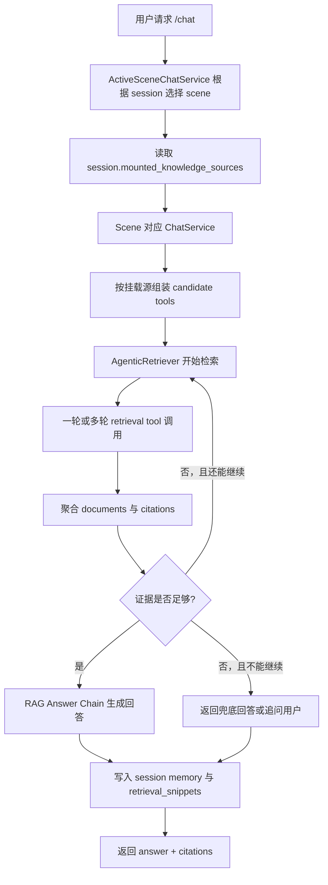
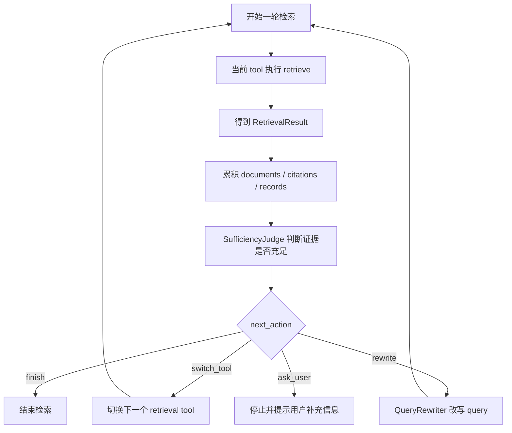
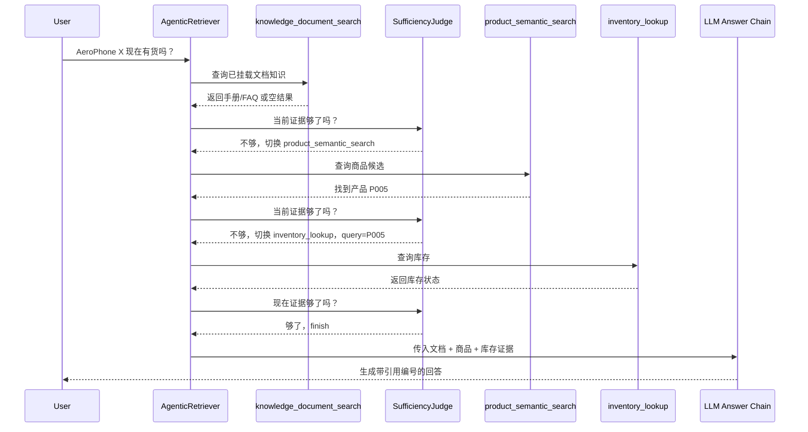

# Agentic RAG 设计说明

这份文档说明本项目当前的 Agentic RAG 实现，重点回答四个问题：

- 检索为什么不是“一次查完”
- 会话级知识源挂载如何影响检索范围
- 什么时候会从文档检索切到电商检索
- 最终回答和 citations 是如何生成与落库的

## 1. 什么是 Agentic RAG

先说结论：

- 普通 RAG 更像“查一次资料，然后直接回答”
- Agentic RAG 更像“先查一轮，判断证据是否够用，不够就补查、改写或追问，再回答”

它的重点不只是“召回”，而是“围绕召回做决策”。

在本项目里，Agentic RAG 负责：

- 选择首轮检索工具
- 约束当前会话允许使用的知识源
- 判断当前证据是否足够
- 必要时切换工具
- 必要时改写 query 再查一轮
- 到达上限后停止，并提示用户补充信息

当前 `generic_assistant` 和 `ecommerce` 两个场景都使用 `AgenticRetriever`，只是默认 prompt、fallback 和场景语义不同。

## 2. 为什么它适合多知识源问答

普通 RAG 适合的问题通常比较直接，比如：

- “这份文档里有没有提到 API 限流？”
- “售后手册里怎么写退换货流程？”

这类问题一次文档检索就可能拿到足够上下文。

但在多知识源场景里，问题往往不是单一来源就能解决，比如：

- “AeroPhone X 现在有货吗？”
- “这款手机值不值得买？”
- “订单 O202604210010 的物流状态是什么？”

这类问题背后通常会拆成几个步骤：

1. 先查用户上传文档，看是否已有直接答案
2. 如果问题明显带电商意图，再切到商品、评论、订单等工具
3. 如果拿到了商品候选，再补查库存或详情
4. 如果还是不够，再改写 query 或提示用户补充信息

这就是 Agentic RAG 的价值：让检索从“一次查库”变成“可决策的多轮证据收集”。

## 3. 本项目里的整体链路

用户请求进入系统后，不是直接把问题丢给模型，而是先经过会话绑定的场景与知识源配置。



一句话概括：

“先按会话允许的知识源检索，边检索边判断，必要时补查，最后再基于证据生成回答。”

## 4. 会话级知识源挂载怎么影响 Agentic RAG

本项目把“场景”和“知识源”拆开了：

- `scene` 决定 prompt、回答风格和运行时语义
- `mounted_knowledge_sources` 决定当前会话允许使用哪些检索工具

当前支持的知识源有：

- `documents`
- `ecommerce`

默认新会话会挂载：

```text
["documents"]
```

如果创建会话时显式传入：

```text
["documents", "ecommerce"]
```

则 Agentic RAG 在文档检索之外，还可以按需使用电商工具。

运行时组装规则位于 `backend/application/runtime/service.py`：

- 挂载 `documents` 时，加入 `knowledge_document_search`
- 挂载 `ecommerce` 时，加入：
  - `product_semantic_search`
  - `review_semantic_search`
  - `order_semantic_search`
  - `inventory_lookup`
  - `product_detail_lookup`

未挂载 `ecommerce` 时，这些工具不会进入候选集合。

## 5. 首轮为什么默认先查文档

`AgenticRetriever` 本身不直接查数据，它只负责编排。

真正执行检索的是一组 retrieval tools。当前主要有：

- `knowledge_document_search`
- `product_semantic_search`
- `review_semantic_search`
- `order_semantic_search`
- `inventory_lookup`
- `product_detail_lookup`

其中：

- `knowledge_document_search` 用于用户上传文档
- `product/review/order semantic search` 用于语义召回
- `inventory_lookup` 和 `product_detail_lookup` 用于结构化精查

当前实现中，`generic_assistant` 和 `ecommerce` 两个场景的 `AgenticRetriever` 都把默认首轮工具设为：

```text
knowledge_document_search
```

原因有两个：

- 文档知识是平台默认挂载知识源，保证纯文档问答路径始终可用
- 即便会话已挂载 `ecommerce`，很多问题仍然可以直接由文档、FAQ、手册或规则说明回答

所以当前策略不是“默认先查商品”，而是“默认先查文档，再按需切电商”。

## 6. 多轮检索闭环

每完成一轮检索，系统不会立刻回答，而是先做一次充足性判断。

判断结果有四种动作：

- `finish`：证据够了，可以结束检索
- `switch_tool`：当前工具不够，需要换一个工具继续查
- `rewrite`：query 太弱，需要改写后重查
- `ask_user`：证据不足，且没有更合适的继续方式，应该让用户补充信息



### 6.1 文档轮的决策

当前 `EcommerceSufficiencyJudge` 的核心策略是“文档优先、按需切换”：

- 如果当前问题更像文档问答，文档命中后可以直接 `finish`
- 如果当前问题有明显电商意图，且会话允许用电商工具，则从文档轮切到合适的电商工具
- 如果文档没命中，且会话允许电商工具，也可以直接转入电商检索

也就是说，文档首轮并不意味着必须只看文档，它只是把“文档证据优先”作为默认主线。

### 6.2 switch_tool

这是 Agentic RAG 最重要的动作之一。

比如用户问：

`AeroPhone X 现在有货吗？`

当前实现通常会经历：

1. 首轮 `knowledge_document_search`
2. 判断问题带库存意图，切到 `product_semantic_search`
3. 定位到商品后，再切到 `inventory_lookup`

这种“先找对象，再做结构化补查”的模式，是本项目电商问答的典型路径。

### 6.3 rewrite

如果当前 query 太模糊、结果为空，或者 judge 认为需要扩大召回面，系统会调用 `QueryRewriter` 改写 query。

当前电商改写器会把口语问法扩展成更适合检索的表达，例如补上：

- `product`
- `specs`
- `reviews`
- `documents`

目的不是润色语言，而是提高下一轮检索的命中概率。

### 6.4 ask_user

如果已经达到允许轮数，或者证据仍然不足，系统不会硬编答案，而是停下来让用户补充更具体的信息。

这也是 Agentic RAG 相比“直接生成”更可靠的地方：它允许系统明确承认“当前证据不够”。

## 7. 一个典型例子：文档首轮，电商补查

以问题：

`AeroPhone X 现在有货吗？`

为例，当前链路通常是这样：



这个例子说明，用户的自然语言问题会在检索过程中逐步转成更适合执行的动作，而不是一上来就交给模型自由发挥。

## 8. 证据如何保存和传递

每轮检索会产出统一结构的 `RetrievalResult`，通常包含：

- `records`：原始或结构化结果
- `documents`：给后续回答链使用的证据文档
- `citations`：用于引用展示和溯源的证据片段
- `confidence`：当前结果置信度
- `metadata`：调试和决策相关信息

多轮检索过程中，`AgenticRetriever` 会聚合这些结果并做去重。

`ChatService` 随后会把聚合后的 `documents` 统一映射成 API 层 `Citation` 结构，当前字段包括：

- `index`
- `citation_id`
- `namespace`
- `source_kind`
- `source_name`
- `source_path`
- `document_id`
- `chunk_id`
- `chunk_index`
- `snippet`
- `score`
- `rank`

这意味着文档证据与电商证据虽然来源不同，但对前端和 API 调用方来说，返回的是同一种 citation 契约。

## 9. 回答正文为什么带 `[1]` 这类编号

当前实现不仅返回结构化 `citations`，还要求最终回答正文能看到可对应的引用编号。

流程是：

1. `ChatService` 先把证据文档改写为带编号的上下文块
2. 回答 prompt 基于这些上下文生成 grounded answer
3. 如果模型没有在正文里输出合法编号，服务会在尾部自动补：

```text
参考来源：[1][2]
```

因此：

- `citations` 负责结构化溯源
- `[1]`、`[2]` 负责让正文引用对用户可见

## 10. 会话历史里保存了什么

一次 `/chat` 完成后，系统会把以下信息写入 session memory：

- `user_message`
- `assistant_answer`
- `retrieval_snippets`

其中 `retrieval_snippets` 保存的是与当前 `Citation` 契约兼容的引用列表。

这样做有两个目的：

- 查询会话详情时，可以还原当时回答对应的引用
- 读取旧历史时，可以兼容旧的 citation 结构而不报错

## 11. 本项目里的关键代码位置

如果要按代码理解这条链路，建议按下面顺序看。

### 入口与运行时

- `backend/application/runtime/service.py`

重点关注：

- `ActiveSceneChatService`
- `ChatService`
- `_retrieve_documents()`
- `_resolve_candidate_tools()`
- `_citations_from_documents()`
- `_invoke_chain_with_docs()`

### Agentic RAG 编排核心

- `backend/platform/rag/core.py`
- `backend/platform/rag/agentic.py`

重点关注：

- `RetrievalPlan`
- `RetrievalResult`
- `SufficiencyDecision`
- `AgenticRetriever.retrieve_with_trace()`

### 场景定义

- `backend/scenes/generic_assistant/definition.py`
- `backend/scenes/ecommerce/definition.py`

重点关注：

- `build_generic_assistant_scene_definition()`
- `_build_generic_agentic_retriever()`
- `create_agentic_knowledge_retriever()`
- `EcommerceSufficiencyJudge`
- `EcommerceQueryRewriter`

### 具体 retrieval tools

- `backend/scenes/ecommerce/retrieval_tools.py`

重点关注：

- `knowledge_document_search`
- `product_semantic_search`
- `review_semantic_search`
- `order_semantic_search`
- `inventory_lookup`
- `product_detail_lookup`

### 行为验证

- `backend/tests/test_agentic_retrieval.py`

这里能直接看到几个关键预期：

- 默认首轮是 `knowledge_document_search`
- 文档问题可以只走文档检索完成回答
- 挂载 `ecommerce` 后才允许切电商工具
- 问库存时会从文档检索切到商品检索，再切到库存查询
- 问参数时会切到详情查询

## 12. 设计收益

这种设计的主要收益有四点。

### 更可靠

不是拿到一点内容就急着回答，而是先判断证据够不够。

### 更适合多知识源

同一个 `/chat` 入口可以在文档、电商等知识源之间按需切换，而不是把所有问题都塞给一个固定 retriever。

### 更容易扩展

后续如果增加新的 retrieval tool，例如售后政策、物流节点、活动规则，只需要：

- 把它纳入候选工具映射
- 在 judge 里补充决策逻辑

### 更容易调试

每轮的工具、query、结果数量和决策原因都会留下 trace，便于排查“为什么这次答得不对”。

## 13. 一句话总结

本项目里的 Agentic RAG 不是“让大模型自己随便检索”，而是：

“把检索做成多轮、可判断、可切换、受会话挂载约束、并能统一回传 citations 的证据编排流程，让系统先把证据找全，再生成回答。”
