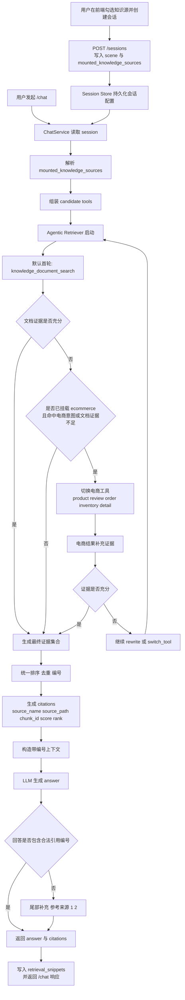

# Agentic RAG可挂载知识源与引用溯源方案

## Summary

状态：已实现并与当前代码对齐。本文记录最终落地行为，不再只描述目标方案。

本次方案的核心目标是：

- 继续保留当前 Agentic RAG 能力，不退回固定单轮检索
- `documents` 作为默认主线与首轮默认检索源
- `ecommerce` 不再因场景自动参与，而是作为“会话已挂载后，Agentic 按需启用”的候选知识源
- 电商知识不应因为“已挂载”就每轮全量参与；只有识别到电商意图，或文档证据不足时，才切入电商工具
- 最终回答必须返回结构化 citations，并在正文中带 `[1]` 这类句末编号

整体目标是把当前“scene 绑定检索来源”的做法，调整为“会话级挂载控制 + Agentic 运行时调度”的两层结构。

## Key Changes

### 1. 明确两层职责：挂载控制 vs Agentic 调度

必须把“能不能用”和“要不要用”分开：

- `mounted_knowledge_sources`
  - 决定哪些知识源允许参与检索
  - 是候选工具白名单
- Agentic RAG
  - 决定当前问题在这些已允许的知识源里，先用哪个、是否切换、何时结束
  - 是运行时调度器

固定规则如下：

- 未挂载 `ecommerce`
  - Agentic 只能使用 `documents`
- 已挂载 `ecommerce`
  - Agentic 可以使用 `documents + ecommerce`
  - 但首轮仍默认从 `documents` 开始
  - 只有识别到电商意图，或文档证据不足时，才切到电商工具

### 2. 检索策略改成“文档优先 + 按需切电商”

本次核心不是“把 ecommerce 加进混排”，而是重构 Agentic 起手与切换逻辑。

目标流程固定为：

1. 用户发起 `/chat`
2. 读取当前 session 的 `mounted_knowledge_sources`
3. 构建本轮允许的 candidate tools
4. Agentic 首轮默认执行文档检索
5. Judge 判断：
   - 若文档证据足够，直接结束
   - 若问题显著带电商意图，切到电商工具
   - 若文档证据不足且已挂载电商，也可以切到电商工具补证据
6. 聚合最终证据，生成 answer + citations

这样可以满足：

- 通用文档召回始终是主线
- 电商知识只在有资格且有必要时参与
- Agentic RAG 仍保留多轮检索和工具切换能力

### 3. 重新定义 candidate tools 组装方式

当前 `AgenticRetriever` 已支持 `candidate_tools`，本次要正式使用，而不是让 scene 默认暴露全套工具。

最终工具分组如下：

#### `documents` 组

- `knowledge_document_search`

#### `ecommerce` 组

- `product_semantic_search`
- `review_semantic_search`
- `order_semantic_search`
- `inventory_lookup`
- `product_detail_lookup`
- 如仍需电商文档检索，可复用 `knowledge_document_search`，不额外新增重复工具

运行时按挂载源组装：

- 仅 `documents`
  - `candidate_tools = ("knowledge_document_search",)`
  - 首轮默认工具仍是 `knowledge_document_search`
- `documents + ecommerce`
  - `candidate_tools` 包含文档工具 + 电商工具
  - 首轮默认工具仍是 `knowledge_document_search`

这样可以避免“只要挂了电商，默认首轮就先打商品检索”的错误行为。

### 4. 新增轻量意图判断，驱动电商工具切换

当前电商 Agentic judge 只在已经进入 `product_semantic_search` 后再判断库存、详情、评论、订单方向，这还不够。

需要新增一个更前置的判断层，用来决定是否要从文档切到电商。建议做成轻量规则优先，不引入额外模型分类器。

新增判断目标：

- 是否为明显电商问题
  - 商品名、库存、价格、参数、推荐、对比
  - 订单号、物流、退款、售后
  - 评论、评分、口碑
- 是否为纯文档问答
  - 术语解释、制度说明、FAQ、知识文档内容提取
- 是否文档证据不足但问题与电商相关

推荐策略：

- 若 query 命中明显电商关键词，Judge 可在文档首轮后直接 `switch_tool`
- 若 query 不明显电商，但文档无命中且挂载了电商，也允许补一次电商检索
- 若 query 纯文档型，即使挂载了电商，也不切电商

### 5. Scene 保留，但不再主导 RAG 知识源选择

本次继续保留 `scene`，但其职责收缩为：

- 决定 prompt 风格
- 决定 agent 名称
- 决定 fallback 话术
- 决定前端场景展示

不再单独决定“本轮该检索哪些知识源”。

也就是说：

- `scene = generic_assistant`
  - 可以挂载 `documents`
  - 也可以挂载 `documents + ecommerce`
- `scene = ecommerce`
  - 也仍可存在
  - 但其 RAG 行为同样受 `mounted_knowledge_sources` 约束
  - 不应再默认强制从商品检索起步

这一步能避免“场景”和“知识源”两个概念继续绑死。

### 6. `/sessions` 增加挂载源，`/chat` 读取会话配置

接口层引入会话级知识源挂载配置。

#### `POST /sessions`

新增请求字段：

- `mounted_knowledge_sources: list[str] | None`

默认行为：

- 不传时默认 `["documents"]`

响应新增：

- `mounted_knowledge_sources`

#### `GET /sessions/{session_id}`

响应新增：

- `mounted_knowledge_sources`

#### `POST /chat`

不要求每轮传挂载源，只从会话读取。

运行时行为：

- `ChatService` 读取 session 的 `mounted_knowledge_sources`
- 基于挂载源动态组装 candidate tools
- 使用 Agentic RAG 编排检索

### 7. 引用溯源按统一 citation 契约落地

无论最终命中的是文档还是电商知识，都统一返回 citations；但本次主验收重点仍是文档 provenance。

当前 `Citation` 固定字段：

- `index: int`
- `citation_id: str`
- `namespace: str`
- `source_kind: str`
- `source_name: str`
- `source_path: str | None`
- `document_id: str | None`
- `chunk_id: str | None`
- `chunk_index: int | None`
- `snippet: str`
- `score: float | None`
- `rank: int`

当前 `source_kind` 映射规则：

- 文档 metadata 里存在 `chunk_id` 或 `document_id` 时，统一映射为 `document_chunk`
- `products` 命名空间映射为 `product`
- `reviews` 命名空间映射为 `review`
- `orders` 命名空间映射为 `order`
- `inventory` 命名空间映射为 `inventory`
- `product_detail` 命名空间映射为 `product_detail`

文档 citation 至少保证：

- `source_name`
- `source_path`
- `chunk_id` 或 `chunk_index`
- `snippet`
- `score`
- `rank`
- `index`

回答正文当前实现：

- 模型提示词会拿到带 `[1]` 编号和来源头信息的上下文块
- 若模型输出中已包含任意 `[\d+]` 编号，服务端直接保留
- 若模型没有输出任何合法编号，服务端会在尾部补 `参考来源：[1][2]`

### 8. 已落地的 ecommerce Agentic 调整

当前实现已经完成以下修正：

- 已挂载电商时也从 `knowledge_document_search` 起步
- 只有 Judge 判定需要时才切电商工具
- 未挂载电商时，电商工具不会进入 `candidate_tools`
- `ChatService` 还会按当前 scene 实际注册的工具集合再做一次过滤，避免未注册工具进入候选集

### 9. 前端交互调整

`frontend/api-tester.html` 需要新增会话级知识源勾选区：

- 默认勾选 `documents`
- 可选勾选 `ecommerce`
- 创建新会话或切场景时，把勾选结果带到 `POST /sessions`
- 会话建立后，在页面上展示当前挂载源
- `/chat` 回复展示 citations 时，显示文档名、chunk 信息、score、编号

`frontend/knowledge-manager.html` 本次不承担“挂载知识源”的产品入口，仍负责：

- 文件上传
- 预处理/切块/入库
- namespace 维度的知识文档维护

如有必要，仅在文档或提示文案中说明：

- 知识是否参与 RAG 由会话挂载决定
- 不由知识管理页直接控制

## Public Interfaces

### `SessionCreateRequest`

新增：

- `mounted_knowledge_sources: list[str] | None`

### `SessionCreateResponse`

新增：

- `mounted_knowledge_sources: list[str]`

### `SessionDetailResponse`

新增：

- `mounted_knowledge_sources: list[str]`

### `ChatResponse`

当前响应只扩展 `citations` 结构，不返回 `mounted_knowledge_sources`。挂载源通过会话接口读取。

### 内部统一常量

当前已提供统一工具：

- 默认挂载源解析
- 非法值校验
- knowledge source -> candidate tools 映射

实际常量为：

- `SUPPORTED_MOUNTED_KNOWLEDGE_SOURCES = ("documents", "ecommerce")`
- `DEFAULT_MOUNTED_KNOWLEDGE_SOURCES = ("documents",)`

## Test Plan

### 自动化测试

已覆盖的自动化测试场景：

- 会话默认挂载
  - 不传挂载源时为 `["documents"]`
- 文档主线
  - 已挂载 `documents + ecommerce` 时，如果问题是纯文档问答，Agentic 只用文档工具即可完成
- 电商按需启用
  - 已挂载 `documents + ecommerce` 时，如果问题是库存、订单、评论类，首轮文档后会切到对应电商工具
- 未挂载电商
  - 即使问题是订单、商品相关，也不会调用电商工具
- 当前 ecommerce 兼容
  - `scene = ecommerce` 但未挂载 `ecommerce` 时，不应默认打商品检索
- citation
  - 文档命中返回统一 citation 字段
  - `answer` 中包含 `[1]` 或尾部补充 `参考来源`
- session detail
  - 能正确返回挂载源
  - 能兼容旧 `retrieval_snippets` 结构

### 本地验收

至少做三条链路：

1. `documents` only
   - 上传文档
   - 预处理/切块/入库
   - 创建仅挂载文档的会话
   - 提文档问题
   - 验证只走文档主线，返回文档引用

2. `documents + ecommerce`，但问题是纯文档
   - 验证不会无谓触发电商检索

3. `documents + ecommerce`，问题是电商
   - 验证 Agentic 会按需切到商品、订单、评论工具
   - 最终 citations 正确展示来源

## Assumptions

- Agentic RAG 保留，不退回固定单轮检索
- `documents` 是默认且必选挂载源；电商只能作为增量挂载
- “电商知识按需加载”定义为：
  - 已挂载后才有资格参与
  - 只有在意图匹配或文档证据不足时才被 Agentic 启用
- `scene` 继续存在，但不再等价于“必须使用哪类知识源”
- 文档级完整 provenance 是本次重点；电商来源先保证统一 citation 结构和可识别来源，不强求与文档 chunk 同等粒度
- 需要同步检查并更新：
  - `README.md`
  - `AGENTS.md`
  - `docs/api-list.md`
  - `docs/data-model.md`
