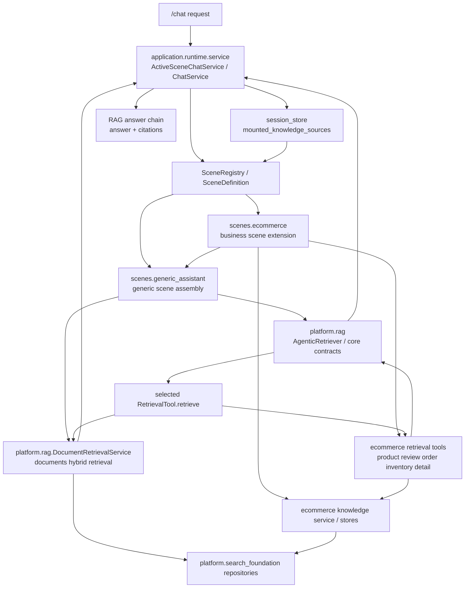

# Generic Assistant通用Agentic RAG主链边界与场景扩展方案

## Summary

本方案用于收敛当前 `generic_assistant`、`ecommerce` 与核心 `Agentic RAG` 的职责边界，解决“默认场景复用电商专属逻辑”与“新增业务场景缺少稳定扩展入口”两个问题。

最终结构固定为三层：

- `backend/platform/rag`
  - 核心 Agentic RAG 编排与文档召回底座
  - 只回答“怎么检索、怎么编排”，不回答“什么时候切电商、什么时候切订单”
- `backend/scenes/generic_assistant`
  - 默认通用场景
  - 承载 docs-first 召回主链、通用 sufficiency judge、通用 query rewriter、业务扩展接口
- `backend/scenes/ecommerce`
  - 业务场景扩展
  - 只承载电商专属 retrieval tools、业务意图识别、结构化补查与 scene 装配

一句话概括：

“`platform.rag` 是核心底座，`generic_assistant` 是默认通用主链，`ecommerce` 及后续业务场景都是在 generic 主链上注册扩展，而不是反向承载 generic 的核心实现。”

## Key Changes

### 1. 固定三层边界

#### `platform.rag`

保留：

- `AgenticRetriever`
- `RetrievalTool`
- `RetrievalPlan`
- `RetrievalResult`
- `SufficiencyJudge`
- `QueryRewriter`
- `DocumentRetrievalService`
- `DocumentSemanticRetriever`
- `DocumentKeywordRetriever`
- `HybridFusionRanker`

职责固定为：

- 调用当前轮次选中的 retrieval tool
- 聚合 `documents / citations / records`
- 根据 scene 注入的 judge / rewriter 做 `finish / switch_tool / rewrite / ask_user`
- 提供 `documents` 知识源的统一 Hybrid Search 能力

明确不做：

- 不内置 `ecommerce` 关键词
- 不关心 `product_semantic_search`、`order_semantic_search` 这些业务工具名
- 不决定某个 scene 是否应该切入业务知识源

#### `generic_assistant`

固定为“通用 scene 层”，不是 `platform` 核心，也不是某个业务 demo。

职责固定为：

- 提供默认 `knowledge_document_search`
- 提供 docs-first 通用 judge
- 提供中性 query rewriter
- 提供 scene 级扩展接口，允许其他业务场景挂入额外 knowledge source
- 组装默认的 `AgenticRetriever`

默认行为固定为：

- 首轮默认查 `knowledge_document_search`
- 文档证据足够时优先结束
- 文档空结果时优先 rewrite，再决定是否 ask_user
- 不内建任何电商、订单、评论、库存词表

#### `ecommerce`

固定为 generic 主链的业务扩展实现。

保留：

- `KnowledgeService`
- `ProductCatalogStore`
- `product/review/order` retrieval tools
- `inventory_lookup`
- `product_detail_lookup`
- scene prompt、fallback、bootstrap、complexity

职责固定为：

- 声明自己提供哪些 retrieval tools
- 声明何时从 documents 切到电商工具
- 声明切入电商后下一步如何继续补查
- 可选提供业务化 rewrite 增强

明确不再承担：

- 不再给 `generic_assistant` 提供默认 judge / rewriter / tool builder
- 不再作为默认场景核心召回主链的宿主

### 2. 说清楚“召回”分成两层

本次必须把召回拆成两层，避免继续混用。

#### 底层召回执行

职责是“真查数据”。

具体承担者：

- `DocumentRetrievalService`
  - 负责 `documents` 的 semantic + keyword + fusion
- `ecommerce` 自己的知识服务与结构化 store
  - 负责 `products / reviews / orders / inventory / product_detail`

输出统一为 `RetrievalResult`。

#### 上层召回路由

职责是“决定这一轮查谁、是否补查、是否改写、是否结束”。

具体承担者：

- `generic_assistant` 的通用 docs-first judge
- 业务扩展注册进来的场景化路由逻辑

`platform.rag.AgenticRetriever` 只执行编排，不拥有业务路由语义。

### 3. 把 candidate tools 解析权从 runtime 收回给 scene

当前 `application/runtime/service.py` 中按 `mounted_knowledge_sources` 硬编码 tool name 的方式需要收口。

重构后固定为：

- runtime 只读取当前 session 的 `mounted_knowledge_sources`
- runtime 向当前 scene definition 请求“在这些 knowledge source 下，本 scene 可用的 candidate retrieval tools”
- scene definition 内部再决定：
  - 默认文档工具
  - 哪些业务扩展生效
  - 最终 candidate tools 顺序

这一步的收益：

- runtime 不再知道 `inventory_lookup`、`product_detail_lookup` 等业务细节
- scene 自己对“可挂载知识源”和“候选检索工具”负责
- 后续新增业务场景时，不需要改 runtime 硬编码

### 4. generic 主链支持可插拔业务扩展

`generic_assistant` 默认仍然是 docs-first，但必须允许扩展知识源注册。

建议的扩展接口至少表达：

- `knowledge_source` 名称
- 该扩展提供的 retrieval tools
- 默认启用条件
- 从 documents 切入该扩展的判定逻辑
- 扩展内部的 follow-up tool 决策逻辑
- 可选 query rewrite 增强

固定扩展顺序：

1. 先跑 generic 默认 documents 检索
2. generic judge 先判断文档是否已足够
3. 若不足，再按已挂载扩展依次询问是否接管下一跳
4. 有扩展接管则切换到扩展工具
5. 无扩展接管则走 generic 默认 rewrite / ask_user

这里的关键是：

- generic 主链只提供“扩展点”和“调度顺序”
- 业务场景只注入自己的切换规则
- generic 本身不再直接写死 `ecommerce` 跳转条件

## Package Call Graph

下图描述包间调用关系与扩展方向。渲染源文件见：

- [generic-agentic-rag-package-architecture.mmd](/d:/Programs/interview-projects/ai-rag-project/docs/plan/generic-agentic-rag-package-architecture.mmd)
- [generic-agentic-rag-package-architecture.svg](/d:/Programs/interview-projects/ai-rag-project/docs/plan/generic-agentic-rag-package-architecture.svg)

### 调用关系解释

#### 请求入口

- `/chat` 进入 `application.runtime.service`
- runtime 读取 session 的 `mounted_knowledge_sources`
- runtime 根据当前 session 绑定的 scene，从 `SceneRegistry` 拿到对应 `SceneDefinition`

#### scene 装配层

- `SceneDefinition` 是 runtime 与 scene 的边界
- `generic_assistant` 提供默认主链装配
- `ecommerce` 既可以暴露自己的 scene，也可以作为 generic 主链上的扩展实现

#### 核心编排层

- `platform.rag.AgenticRetriever` 只做编排
- 它执行 `RetrievalTool.retrieve()`，拿到 `RetrievalResult`
- 再根据 scene 注入的 judge / rewriter 继续下一轮

#### documents 召回

- `knowledge_document_search` 最终调用 `DocumentRetrievalService`
- `DocumentRetrievalService` 再向 `platform.search_foundation` 提供的 repository 查向量与文本源
- 通过 semantic + keyword + fusion 形成统一文档召回结果

#### ecommerce 召回

- 电商 retrieval tools 调自己的知识服务或结构化 store
- 然后把结果映射成统一 `RetrievalResult`
- 这样上层 `AgenticRetriever` 无需区分“这是文档结果还是电商结果”

## RAG Scene Extension

### 1. 新增一个业务 RAG scene 的标准方式

以后要扩展新的业务场景，例如 `crm`、`hr`、`ticketing`，固定步骤如下：

1. 在 `backend/scenes/<scene_name>/` 下实现业务知识访问层
2. 实现该业务的 retrieval tools，并统一返回 `RetrievalResult`
3. 实现 generic 扩展接口：
   - 声明 `knowledge_source`
   - 暴露 retrieval tools
   - 定义切入条件
   - 定义 follow-up tool 决策
   - 可选定义业务 rewrite 增强
4. 在该 scene 的 `build_<scene_name>_scene_definition()` 中：
   - 复用 generic 主链装配
   - 注入自己的扩展实现
   - 再叠加本 scene 的 prompt / fallback / bootstrap / complexity
5. 在 scene registry 中注册该 scene definition
6. 如需会话级挂载，则把对应 `knowledge_source` 加入支持列表

### 2. 新业务场景的实现约束

新增业务 scene 时必须满足以下约束：

- 不允许把通用 judge / rewriter 回写到业务包中给 generic 反向复用
- 不允许让 runtime 知道新的业务 tool name
- 不允许把业务召回算法塞回 `platform.rag`
- 不允许把 scene 级业务路由逻辑塞到 `platform`

换句话说：

- `platform` 只接收中立契约
- `generic_assistant` 只接收中性通用能力
- `<business_scene>` 自己实现业务扩展

### 3. 新业务 scene 的最小包职责模板

建议一个业务场景至少包含：

- `definition.py`
  - scene 装配入口
- `retrieval_tools.py`
  - retrieval tool 定义与结果映射
- `knowledge_service.py` 或 `stores.py`
  - 底层知识访问
- 可选 `loader.py`
  - demo 数据预热

如果出现以下情况，应视为边界违规：

- `generic_assistant` import 该业务场景中的 judge / rewriter
- runtime 为该业务场景硬编码工具名
- 业务场景直接复制一份 `AgenticRetriever` 主链而不复用 generic 装配

## Public Interfaces

建议把以下能力提升为正式接口，而不是散落在 `metadata` 或 runtime 硬编码里：

- `SceneDefinition`
  - 新增“按 knowledge source 解析 candidate retrieval tools”的正式字段或方法
- `generic_assistant`
  - 新增“scene 扩展接口”或“knowledge source 扩展接口”
- `build_generic_assistant_scene_definition`
  - 支持接收扩展实现列表
- `build_<business_scene>_scene_definition`
  - 复用 generic 主链装配，而不是自建默认主链

兼容性要求：

- 外部入口函数名尽量保持稳定
- 对上层 `/chat` API 不引入协议变化
- 变动主要控制在 scene 装配与内部调用边界

## Implementation Status

当前实现已按本文边界落地以下约束：

- `generic_assistant` 自持默认 docs-first judge / query rewriter / documents tool 组装，不再 import `ecommerce` 默认路由实现
- `SceneDefinition` 已提供正式的 candidate retrieval tool resolver，runtime 仅委托 scene 解析，不再维护 knowledge source 到业务 tool name 的硬编码映射
- `ecommerce` 已作为 generic business extension 参与 handoff 和 follow-up routing；其 demo 数据预热已回归 scene bootstrap，而不是混入 retrieval tool builder
- 默认 scene 与 business extension 的组合装配已收敛到 `backend/scenes/registry.py`，不再把扩展注册写死在 runtime 主链内部

当前实现同时明确以下负向约束：

- `generic_assistant` 不得 import `EcommerceSufficiencyJudge`、`EcommerceQueryRewriter` 或旧的默认 retrieval tool builder
- runtime 不得根据 `documents / ecommerce` 直接推导候选业务 tool 名
- docs 证据已足够时，已挂载扩展不得抢占 generic 默认主链

## Test Plan

必须覆盖以下场景：

### generic 主链

- docs-only 问题只走 `knowledge_document_search`
- generic 包不再 import `ecommerce` judge / rewriter / retrieval tool builder
- 文档空结果时走 generic 默认 rewrite / ask_user

### generic + ecommerce 扩展

- 已挂载 `ecommerce` 时，generic 可以通过扩展点切入电商工具
- 切换依据来自 ecommerce 扩展实现，不来自 generic 内部硬编码词表
- 订单、库存、参数等问题仍能走通当前多轮补查链路

### runtime

- `candidate_tools` 来自 scene definition，而不是 runtime 内部硬编码业务工具名
- `mounted_knowledge_sources=("documents",)` 时只暴露文档工具
- `mounted_knowledge_sources=("documents", "ecommerce")` 时按 scene 装配暴露扩展工具

### 已落地验证

- `backend/tests/test_agentic_retrieval.py`
  - 验证 generic 不再引用 ecommerce 默认路由符号
  - 验证 docs-only、docs-sufficient、docs+extension 三类主链边界
- `backend/tests/test_chat_api.py`
  - 验证 runtime 透传 scene definition 返回的 candidate tools
  - 验证 mounted source 变化时 generic scene 与 ecommerce extension 的行为差异

### 扩展性

- 新增一个伪业务扩展时，不修改 runtime 也能挂入 generic 主链
- 新业务扩展的 retrieval result 仍能被统一映射成 citations

## Assumptions

- `platform.rag` 被视为核心 Agentic RAG 底座，不承载 scene 语义。
- `generic_assistant` 被视为默认通用 scene 主链，不等同于 `platform`。
- `ecommerce` 是 generic 主链上的业务扩展，而不是 generic 的父层。
- 默认策略仍是 docs-first，但是否切业务知识源由扩展接口驱动。
- 本文描述的是目标边界；后续实施时需同步更新相关代码文档与架构图。

